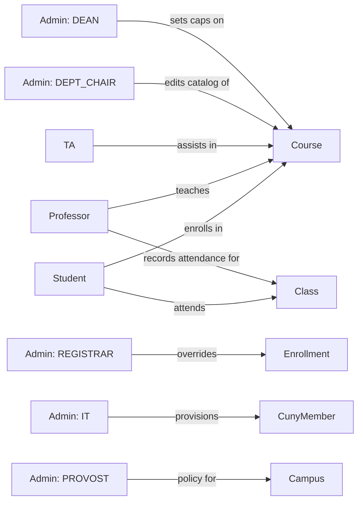

# 01 — Overview

## Goal

A multi-campus student management engine for CUNY: identity, roles, prerequisite-aware enrollment, attendance tracking, and the analytics that fall out of those records. Implemented as a **C++17/20 core** with **Python** bindings — Python drives, C++ does the work.

## Scope (first build)

| In scope | Out of scope (deferred) |
|----------|-------------------------|
| Math / CS / Statistics / Physics catalog | Other departments |
| Multi-role members (student + TA + admin simultaneously) | Cross-campus enrollment |
| Prerequisite DAG with AND/OR groups, cycle detection | Auto-recommended degree plans |
| Time-based schedule conflict detection | Room-based conflicts (Phase 4+ extension) |
| FIFO waitlist with promotion on drop | Priority waitlists |
| Dual-indexed in-memory attendance | OLAP / pre-aggregated analytics |
| In-memory persistence (`InMemoryCunyDatabase`) | SQLite / Postgres (Phase 7+) |
| Admin role family: `IT`, `REGISTRAR`, `DEPT_CHAIR`, `DEAN`, `PROVOST` | Custom per-campus admin levels |

## Non-goals

- Authentication / authorization wire format. We model roles; we don't issue tokens.
- Real-time notifications. Fire-and-forget hooks exist; delivery is someone else's problem.
- Distributed deployment. Single process, single data center.

## Glossary

| Term | Meaning |
|------|---------|
| **CunyMember** | A person attached to a campus, carrying ≥1 roles. |
| **Role** | A capability/identity attached to a member: `StudentRole`, `ProfessorRole`, `AdminRole`, `TeachingAssistantRole`. |
| **Campus** | An institution (CCNY, Brooklyn College, Hunter, …) with its own factory, email domain, and config. |
| **Course** | A teachable unit owned by a campus, in one of `MATH | CS | STATS | PHYS`. |
| **Prerequisite** | A directed edge in the prereq DAG. Edges carry AND/OR semantics via a `groupKey`. |
| **Enrollment** | A `(studentId, courseId)` pair with a status: `ENROLLED | WAITLISTED | DROPPED | COMPLETED`. |
| **Waitlist** | A FIFO queue of `CunyMember` references for a full course. |
| **Attendance Record** | One `(enrollmentId, date)` row with a status, minutes attended, and notes. |
| **DAG** | Directed Acyclic Graph — the prereq relation. Cycles are rejected on edge add. |

## Actors

## Invariants worth holding the line on

1. **Prereq DAG is acyclic.** Enforced on every `addPrereq` call (3-color DFS — see `algorithms/06-prerequisite-graph.md`).
2. **Email + employeeId are globally unique.** Enforced as DB constraints; collision pre-check uses a Bloom filter (see `algorithms/07-attendance-indexing.md`).
3. **`prereqsAtEnrollment` is frozen.** An enrollment's eligibility is determined by the prereqs *at the moment of enrollment*. Later prereq edits don't retroactively invalidate prior enrollments.
4. **Waitlist promotion is atomic.** A student is never simultaneously `WAITLISTED` and `ENROLLED` for the same course.
5. **Dual-index consistency.** Both attendance indexes are written before the user sees success — async DB write happens after.

These invariants drive the testing strategy (see `conventions/19-python-style.md` — `hypothesis` property tests).
