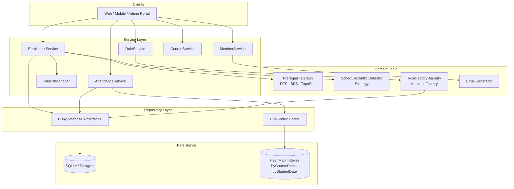
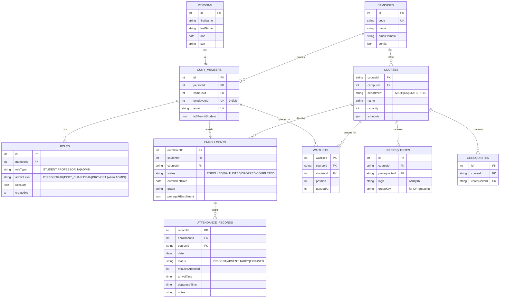
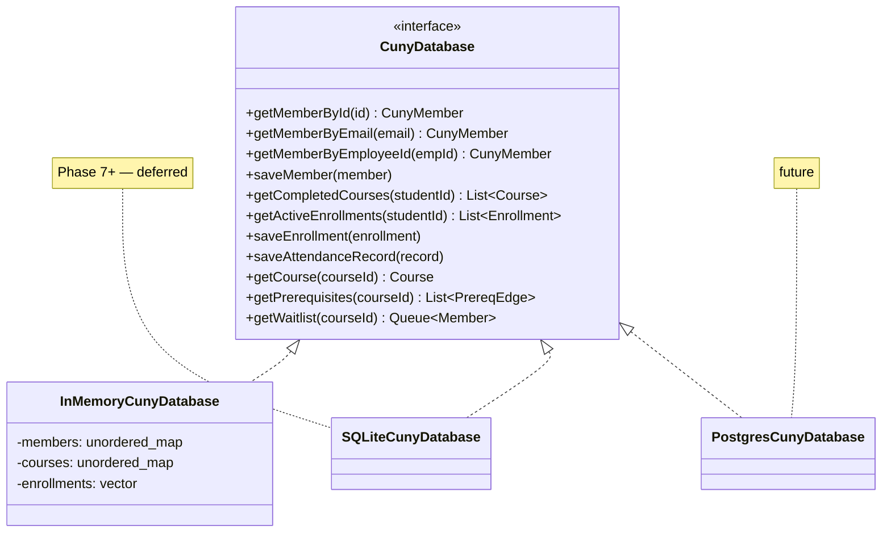

# 02 — Architecture

System layering, the persistent data model, and the database abstraction. Three diagrams.

## Renderer note: mermaid + LaTeX

Several chapters (especially the math chapters 12–17) embed LaTeX in mermaid via `$$…$$`. This requires:

- mermaid **≥ 10.9.0** with KaTeX support enabled, **and**
- a viewer that runs the mermaid theme (VS Code's mermaid preview, GitHub markdown rendering, mkdocs-material with the `pymdownx.arithmatex` + mermaid plugins).

Setup snippet for a custom mkdocs config:

```yaml
markdown_extensions:
  - pymdownx.superfences:
      custom_fences:
        - name: mermaid
          class: mermaid
          format: !!python/name:pymdownx.superfences.fence_code_format
extra_javascript:
  - https://cdn.jsdelivr.net/npm/mermaid@10.9.0/dist/mermaid.min.js
```

In a label, quote with double quotes and use `$$…$$` for math:

```text
A["$$\sigma^2 = \tfrac{1}{n}\sum (x_i - \bar{x})^2$$"]
```

If the viewer doesn't support math, the formula degrades to literal text — readable but not pretty.

---

## High-level system architecture



The four layers correspond to four directories in the C++ source tree (see `conventions/20-build-system.md`):

| Layer | Source dir | Responsibility |
|-------|-----------|----------------|
| Service | `src/services/` | Use-case orchestration; transaction boundary |
| Domain Logic | `src/domain/` | Pure business rules; no I/O |
| Repository | `src/persistence/` | Database abstraction + index maintenance |
| Persistence | bundled deps | SQLite (later) + in-process HashMaps |

---

## Physical data model — ER diagram



Note: `COURSES.department` is restricted to `MATH | CS | STATS | PHYS` for the first build (see `01-overview.md`). `ROLES.adminLevel` is meaningful only when `roleType = ADMIN`; otherwise `NULL`.

---

## Repository pattern — database abstraction

Business logic depends on the interface, not the implementation. Phase 6 of the roadmap ships **only `InMemoryCunyDatabase`**; SQLite arrives later.



Why this matters: the dual-index attendance cache (see `algorithms/07-attendance-indexing.md`) is a *read* layer in front of `CunyDatabase`. Swapping in SQLite later is purely an implementation change; the cache, and every service above it, is unaffected.
