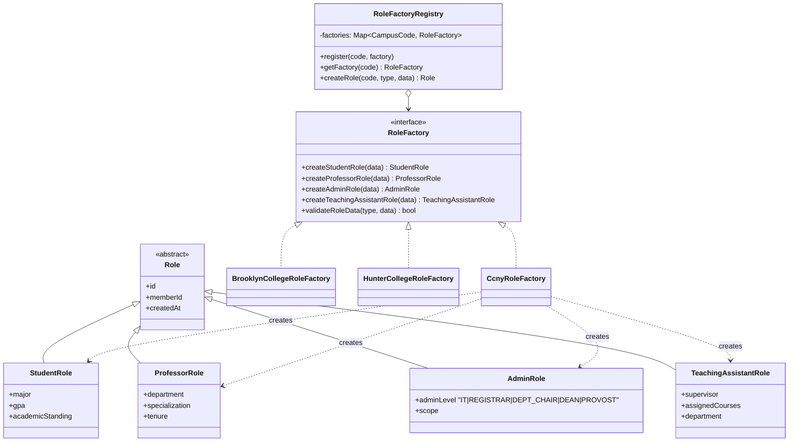
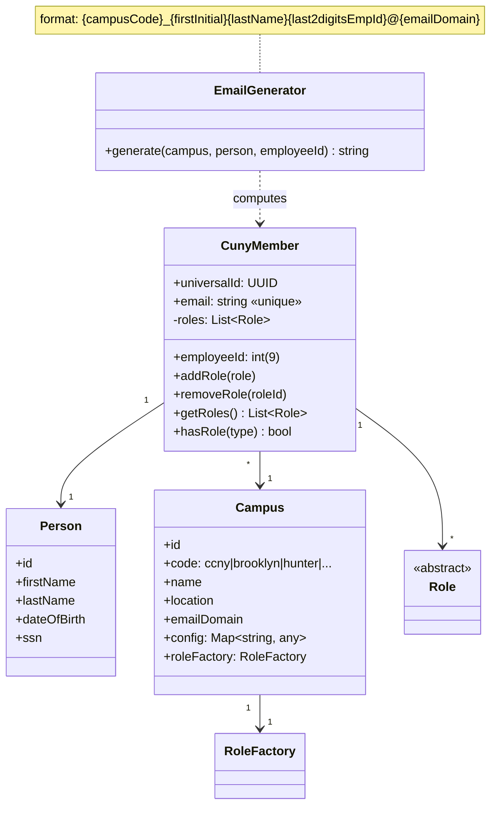
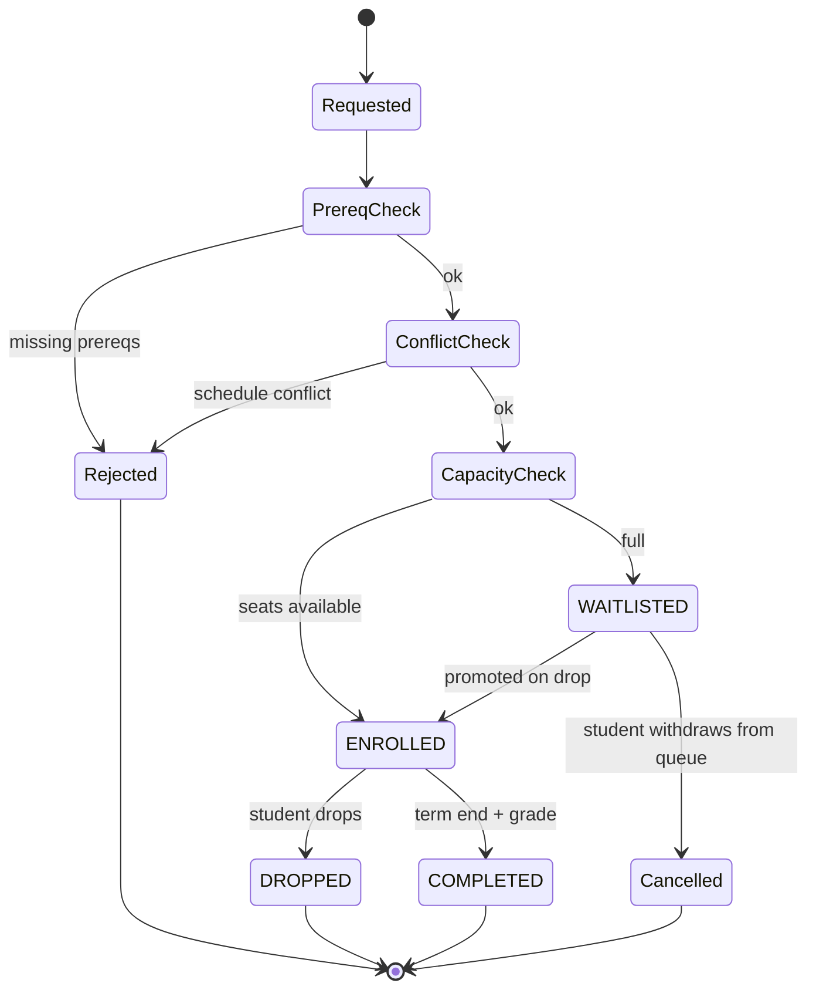

# 03 — Domain Model

The core entities — members, roles, identity — and how they compose.

## Scope: courses are Math / CS / Stats / Physics only

For the first build, the course catalog is restricted to four departments:

| Code   | Department          | Sample courses |
|--------|---------------------|----------------|
| `MATH` | Mathematics         | Math101 Calc I, Math201 Calc II, Math301 Linear Algebra |
| `CS`   | Computer Science    | CS101 Intro, CS102 Data Structures, CS201 Algorithms, CS301 Systems, AI301 |
| `STATS`| Statistics          | Stats101 Intro, Stats201 Inference, Stats301 Bayesian |
| `PHYS` | Physics             | Phys101 Mechanics, Phys201 E&M, Phys301 Quantum |

This restriction lives in code as a `Department` enum and a `CHECK` constraint in `courses.department`. Adding more departments later is an additive change — no existing rows or invariants change.

## Admin role family

`AdminRole` is a single role type with a sub-classifier `adminLevel`. Levels in the first build:

| Level | Scope |
|-------|-------|
| `IT` | Account provisioning, password resets, email-format overrides |
| `REGISTRAR` | Manual enrollment overrides, waitlist promotions, transcript edits |
| `DEPT_CHAIR` | Course catalog edits within their department |
| `DEAN` | Multi-department visibility, capacity caps |
| `PROVOST` | System-wide policy (cross-campus enrollment, audit) |

Levels are an enum, not a string, so the type system enforces them.

---

## Multi-role architecture — Abstract Factory

`CunyMember` *composes* a `List<Role>`; it does **not** inherit from any role class. A user can simultaneously be a student, a TA, and an IT admin — three independent rows in `roles`, no inheritance gymnastics.

Each campus factory can override validation: e.g., `BrooklynCollegeRoleFactory` may require advisor sign-off before constructing a `StudentRole`, while `CcnyRoleFactory` can auto-approve. The interface defines the contract; the implementation varies.

---

## Member identity — three-part ID

Three IDs, three purposes:

| ID | Stable across | Purpose |
|----|---------------|---------|
| `universalId` (UUID) | Forever | Database joins, external references |
| `employeeId` (9-digit) | Forever | Business-facing identifier; printed on ID cards |
| `email` (derived) | Until name change | Authentication, communication |

The "last 2 digits of employee ID" suffix in email is a collision-avoidance hint, not a uniqueness mechanism — see `math/13-probability.md` for the birthday-paradox math driving the choice between 2-digit and 3-digit suffixes.

---

## Enrollment lifecycle — state machine

Two important properties:

1. The status field stored in `enrollments.status` only ever holds the four terminal-ish states: `ENROLLED`, `WAITLISTED`, `DROPPED`, `COMPLETED`. The `Requested`/`PrereqCheck`/`ConflictCheck`/`CapacityCheck`/`Rejected` states exist only during the synchronous `enroll()` call; they're never persisted.
2. `ENROLLED → WAITLISTED` is **not** a legal transition. If capacity changes (e.g., the room is downsized), the registrar must explicitly drop and re-waitlist via an admin tool.
