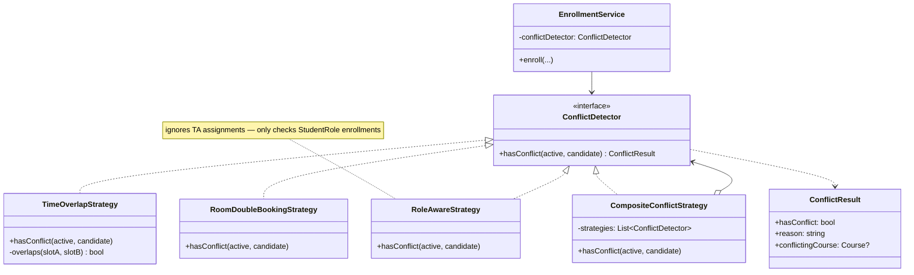

# 04 — Design Patterns

Three patterns carry the architecture: **Abstract Factory** (role creation, see `03-domain-model.md`), **Strategy** (conflict detection), **Repository** (database abstraction, see `02-architecture.md`). This chapter focuses on Strategy and the cross-cutting trade-offs.

## Strategy — schedule conflict detection

Conflict rules evolve. We start with time-overlap, but room double-booking, role-aware checks, and prereq-completion checks all want to plug in. The Strategy pattern keeps `EnrollmentService` agnostic.

The `CompositeConflictStrategy` pattern (Composite over Strategy) lets the service ask one detector and receive a unified verdict. Order matters: cheap rules first (time overlap is O(n) over a tiny n), expensive rules (room availability across the whole campus) last — short-circuit on first conflict.

For the algorithmic guts (interval trees, sweep-line) see `algorithms/08-schedule-conflict.md`.

---

## Trade-off table

| Pattern | What we gain | What it costs | When to skip |
|---------|--------------|---------------|--------------|
| Abstract Factory (`RoleFactoryRegistry`) | Per-campus customization without forking the core role types | One factory class per campus, even if behavior is identical | If only one campus ever exists |
| Strategy (`ConflictDetector`) | Add new conflict rules without touching `EnrollmentService` | An extra interface for what may be one rule today | If conflict logic is provably stable forever |
| Repository (`CunyDatabase`) | Swap SQLite ↔ Postgres, mock in tests | Forces every query through the interface; can't shortcut to raw SQL in services | Never — the test ergonomics alone justify it |

---

## Composition over inheritance

`CunyMember` deliberately holds `List<Role>` instead of inheriting from a `Student` / `Professor` / etc. base. The reason is concrete: a real CCNY person can be **simultaneously** a graduate student, a TA, and a part-time IT admin. Inheritance forces a single-rooted tree, which models that as either:

- Three separate `CunyMember` rows (breaks identity), or
- A monster `Student & TA & Admin` class (breaks the type system).

Composition lets the same `CunyMember` row carry three `Role` rows, each with its own data shape and lifecycle. The `RoleFactory` produces them; the service layer asks `member.hasRole(STUDENT)` when needed.

This is the same reasoning that makes `Role` an **abstract** base with concrete subclasses (`StudentRole`, `AdminRole`, …) rather than a tagged union — each subtype legitimately has different fields (`gpa` vs `adminLevel` vs `supervisor`), and a base class plus polymorphism is cleaner than `std::variant<…>` for stable, extensible role hierarchies. (We'd choose `std::variant` if the set of roles were truly closed and we wanted exhaustiveness checks at compile time. It isn't.)
