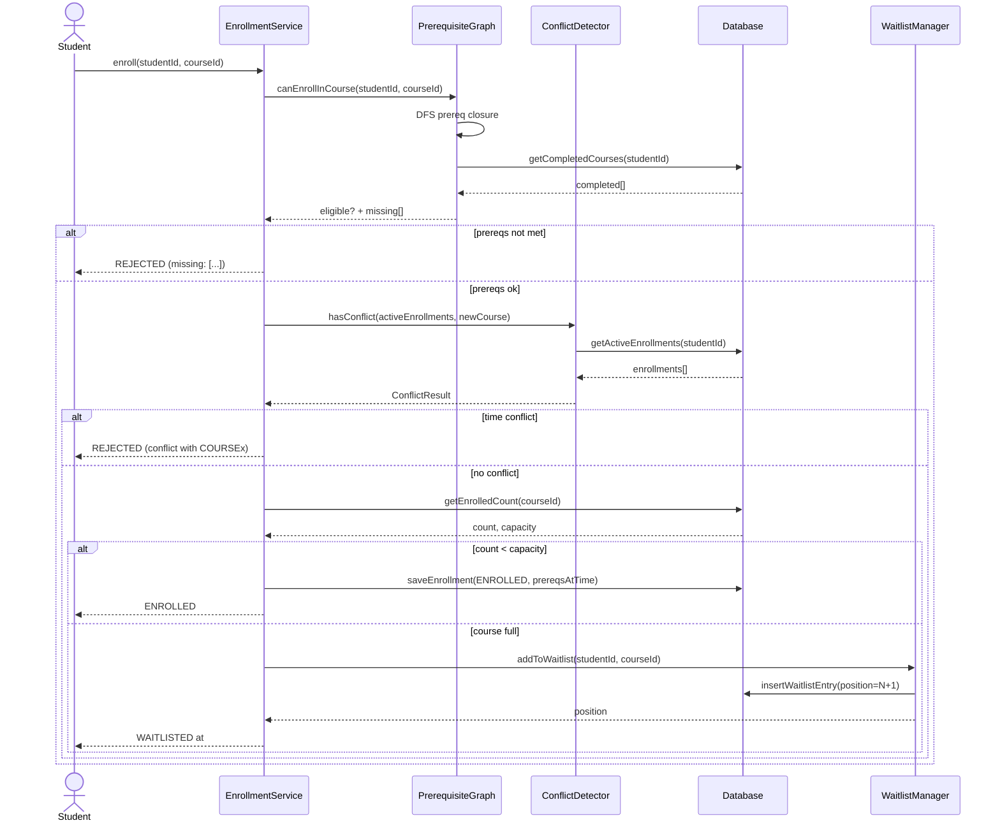
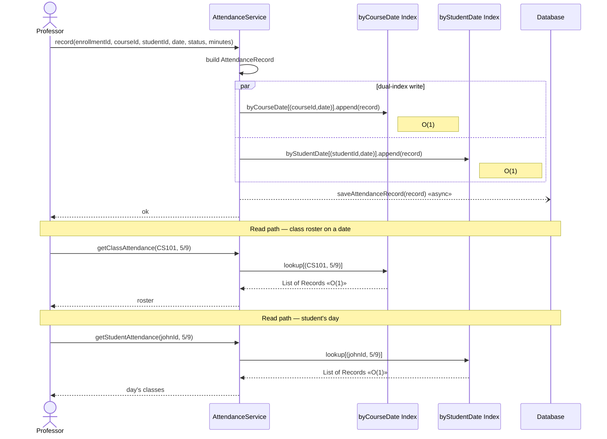
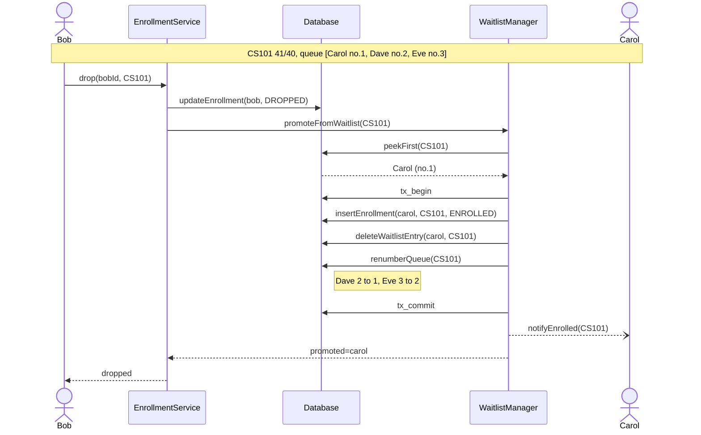

# 05 — Sequence Flows

End-to-end runtime behavior: enrollment, attendance recording, waitlist promotion. Three sequence diagrams. Async arrows use `--)` (mermaid's correct syntax — the earlier draft used the invalid `-)` form).

## Enrollment flow — happy path + waitlist branch

`prereqsAtTime` (a JSON snapshot of the prereq edges at enrollment time) is persisted so a later prereq change can't retroactively invalidate an existing enrollment — see `01-overview.md` on temporal-correctness invariants.

---

## Attendance recording — dual-index update

Why two indexes instead of one + scan? Because both query patterns are equally hot in practice (the professor pulls the class roster every meeting; the student pulls their schedule every morning). A single index would force one of these paths into an O(n) scan — see `algorithms/07-attendance-indexing.md` for the load-factor and Robin-Hood-hashing analysis.

---

## Waitlist promotion on drop

The promotion is a single transaction across `enrollments` and `waitlists` — atomic, so a crash mid-promotion can't leave Carol both enrolled *and* waitlisted (which is the only invariant violation worth worrying about here). The notification is fire-and-forget (`--)`).

For the queue data-structure trade-offs (FIFO `std::deque` vs priority heap vs Fibonacci heap) see `algorithms/09-waitlist-queues.md`.
