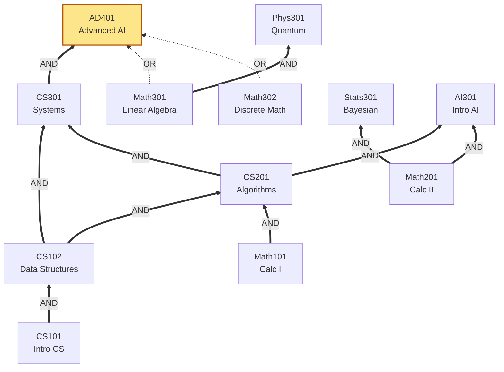

# 06 — Prerequisite Graph

The prereq DAG is the system's most algorithmically interesting structure. This chapter covers cycle detection, transitive closure, topological order, BFS layering, and AND/OR (boolean) prereqs.

## The shape

Nodes are courses; edges are "X is required before Y". Multiple parents form an AND; a special `groupKey` marks edges as part of an OR-group. Concrete example: `AD401` ← `CS301` AND (`Math301` OR `Math302`).



## Algorithms — pick by query shape

| Query | Algorithm | Complexity | Notes |
|-------|-----------|------------|-------|
| "Are there any cycles?" | 3-color DFS | O(V + E) | Run on every `addPrereq`. |
| "Where are *all* the cycles?" | Tarjan's SCC | O(V + E) | Returns SCCs of size ≥ 2. Use for admin tooling. |
| "What's the full prereq closure of X?" | DFS from X (memoized) | O(V + E) once, O(1) cached | Backs eligibility check. |
| "All-pairs prereq matrix" | Floyd–Warshall | O(V³) | Worth it only if catalog is small (V < ~500) and queries are very frequent. |
| "Suggest a course order" | Kahn's algorithm | O(V + E) | One valid order; not unique. |
| "Shortest path to graduation" | BFS layering | O(V + E) | Treats DAG as unweighted; gives course-count, not credit-count. |
| "Is OR-group X satisfiable given completed set S?" | Inclusion-exclusion / 2-SAT reduction | O(2^k) worst, O(k) typical | k = number of OR-groups for the target course. |

### Cycle detection — 3-color DFS

Three node states: `WHITE` (unvisited), `GRAY` (on the current DFS stack), `BLACK` (fully explored). A back edge from any node to a `GRAY` ancestor is a cycle.

```text
function hasCycle(graph):
    color = map all nodes -> WHITE
    for v in graph.nodes:
        if color[v] == WHITE and dfs(v) returns true:
            return true
    return false

function dfs(v):
    color[v] = GRAY
    for w in graph.neighbors(v):
        if color[w] == GRAY: return true        # back edge - cycle
        if color[w] == WHITE and dfs(w): return true
    color[v] = BLACK
    return false
```

Why not BFS? Because cycle detection needs the *call stack* to identify back edges. BFS doesn't have one.

Run this **on every `addPrereq` call**. The cost is amortized acceptable: catalog edits are infrequent compared to enrollment reads.

### Reporting *all* cycles — Tarjan's SCC

A strongly connected component of size ≥ 2 is a cycle (or set of intersecting cycles). Tarjan's algorithm runs a single DFS, maintains a stack of "currently on the path" nodes, and emits SCCs in reverse topological order.

The benefit over plain cycle detection: an admin who tries to add a bad edge gets back **every** cycle they just created, not just the first one DFS happened to hit.

### Transitive closure — eligibility check

Given a target course `T`, compute the set of all transitive prereqs by DFS from `T` (following edges *backward*, since edges point from prereq → dependent). Memoize: prereq closures rarely change between catalog edits, and an LRU cache (`std::list` + `unordered_map`, see `11-caching-memoization.md`) keeps lookups O(1) amortized after the first.

Invalidation: an `addPrereq` invalidates closures of all *descendants* of the new edge's tail. The flowchart in `02-architecture.md` shows the invalidation step.

### Topological order — Kahn's algorithm

For "what's a valid course order?", BFS from all roots (nodes with no prereqs), maintaining an in-degree counter:

```text
function kahn(graph):
    indegree = map v -> count(incoming edges)
    queue = [v for v in graph if indegree[v] == 0]
    order = []
    while queue not empty:
        v = queue.pop_front()
        order.append(v)
        for w in graph.neighbors(v):
            indegree[w] -= 1
            if indegree[w] == 0:
                queue.push_back(w)
    if len(order) != len(graph.nodes):
        raise CycleError
    return order
```

Bonus: Kahn's algorithm doubles as a cycle detector. If the queue empties before all nodes are visited, the unvisited nodes are in cycles.

### BFS layering — shortest path to graduation

Treat the DAG as unweighted (each course = 1 step). BFS from `Math101`/`CS101`/etc. (roots) and record the layer (distance) of each node. The target course's layer is the **minimum number of prerequisite courses** between roots and the target.

This is *not* the same as "fewest credits" (a course can be 3 or 4 credits) and not the same as "shortest semesters" (per-semester capacity matters). For credit-aware shortest path, use Dijkstra with credit weights.

### AND/OR — boolean DAGs and 2-SAT

Pure DAG validation handles AND. OR-groups need extra care: the requirement `(Math301 OR Math302)` is satisfied if the student has completed *either*. We model this in three steps:

1. Each OR-group has a unique `groupKey`. Edges in the same group are alternatives.
2. Eligibility check: for each `groupKey`, OR over members. AND across `groupKey`s + ungrouped edges.
3. **Satisfiability under future schedule**: reduces to 2-SAT if you also constrain "can't take both X and Y in the same term". Tarjan's SCC on the implication graph decides satisfiability in O(V + E).

For the combinatorial side (counting *valid degree plans* — linear extensions of the DAG with OR-group choices), see `math/15-combinatorics.md`. That problem is #P-hard in general; we sample.

## C++ data-structure choices

| Concept | Type | Why |
|---------|------|-----|
| Adjacency list | `std::unordered_map<CourseId, std::vector<PrereqEdge>>` | Sparse graph; vector for cache-friendly iteration |
| In-degree counter (Kahn) | `std::unordered_map<CourseId, std::size_t>` | Mutated during BFS |
| Color array (DFS) | `std::vector<Color>` indexed by interned course-id | Keep small; `enum class Color : uint8_t` |
| Closure cache | `LruCache<CourseId, std::vector<CourseId>>` | See `11-caching-memoization.md` |
| Tarjan's stack | `std::vector<CourseId>` + `std::vector<bool> onStack` | Vector beats stack adapter for indexed access |

## Stack safety

DFS recursion can blow the C++ stack on a pathological catalog. Two mitigations:

1. **Bound the depth**: the prereq DAG should never exceed ~10 levels in practice (CS101 → CS102 → CS201 → CS301 → CS401 → CS501 is already grad-level). Assert in debug.
2. **Iterative DFS** with an explicit `std::vector<Frame>` for production. Same algorithm, no recursion.

## Cross-references

- Cycle invariant — `01-overview.md`
- Closure cache + LRU — `11-caching-memoization.md`
- Counting valid plans — `math/15-combinatorics.md`
- AND/OR satisfiability + 2-SAT — `math/16-optimization.md` (constraint satisfaction)
