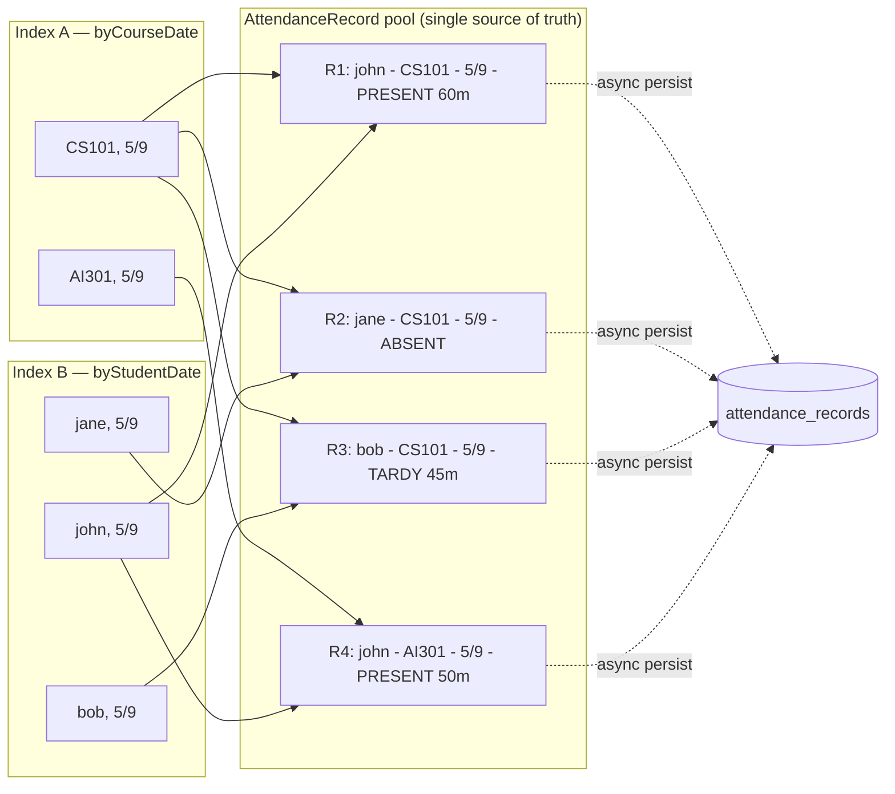

# 07 — Attendance Indexing

The attendance subsystem answers two query patterns equally often:

1. "Who attended CS101 on 5/9?" — keyed by `(courseId, date)`.
2. "What did John attend on 5/9?" — keyed by `(studentId, date)`.

A single index satisfies one cheaply and the other expensively. We maintain **both** in memory, in addition to the SQLite-backed source of truth (later).

## The dual-index structure



A single `AttendanceRecord` is referenced by both indexes. Records are kept in a vector pool; indexes hold non-owning pointers (`AttendanceRecord*`) into the pool. **No duplication** of the record itself; only of the references.

## Hashing strategy

`std::unordered_map` with the default hash and load factor 1.0 is fine — until it isn't. The trade-off space:

| Strategy | Lookup avg | Lookup p99 | Insert | Memory | When to use |
|----------|-----------|-----------|--------|--------|-------------|
| `std::unordered_map` (chained) | O(1) | poor under collisions | O(1) am. | high (node-per-entry) | Default, prototyping |
| `absl::flat_hash_map` (open addr.) | O(1) | better | O(1) am. | low | First-stop performance upgrade |
| Robin Hood hashing | O(1) | **very tight** | O(1) am. | low | When p99 latency matters |
| Cuckoo hashing | O(1) **worst** | O(1) **worst** | O(1) am. | medium | Hard real-time guarantees |
| Perfect hashing (CHD/BBHash) | O(1) **worst** | O(1) **worst** | not supported | very low | Static data only |

### Load factor and resizing

For chained hashing, the average chain length is the load factor `α = n / m`. Lookup is `O(1 + α)`. Resize at `α ≥ 0.75` typically; cost amortizes to `O(1)` per insert.

For open addressing, the cost is `~1/(1−α)` for successful lookup and `~1/(1−α)²` for unsuccessful — collapses dramatically as `α → 1`. Resize at `α ≥ 0.5–0.7`.

### Robin Hood hashing — why we'd reach for it

Robin Hood is open-addressing with a twist: when probing, an entry "steals" a slot from any neighbor with shorter probe distance. Net effect: probe-length variance shrinks dramatically — the worst case approaches the average. For attendance, a slow tail-latency lookup is annoying but not fatal; this is a quality-of-life upgrade more than a correctness one.

### Cuckoo hashing — when worst-case O(1) matters

Two hash functions, two tables. Each item lives in one of two slots; on collision, displace the resident to its *other* slot. Lookup checks two slots, **always two**, so worst-case O(1). Cost: insert can recurse; must rehash on cycle.

We don't need this for attendance reads in a single process. We *would* need it if attendance reads were on a request path with strict SLAs.

### Perfect hashing — for the per-term roster

After a term locks (no more enrollment changes), the (studentId, date) keyspace for that term is **static**. Build a minimal perfect hash function (CHD or BBHash), and lookups become a single hash + a single array load — no probing, ever. Build cost is O(n); query is true O(1) worst-case, often a single cache miss.

For the active-term cache, this is over-engineering. For frozen historical terms (cold storage), it earns its keep.

## Bloom filter — fast-reject pre-check

Before checking "does student X have an attendance record on date D in any course?", a Bloom filter on `(studentId, date)` rejects 99%+ of lookups with one cache line. Membership false positives are fine (we'll then do the real lookup); false negatives are impossible.

Bloom-filter sizing: for `n` insertions and target false-positive rate `p`,

$$m = -\frac{n \ln p}{(\ln 2)^2}, \quad k = \frac{m}{n} \ln 2$$

For 1M `(studentId, date)` entries and `p = 0.01`: `m ≈ 9.6M bits = 1.2 MB`, `k = 7` hash functions. Cheap.

## Memory layout — cache lines matter

A typical `AttendanceRecord` is ~64 bytes (one cache line if packed). Lay out the record pool as a `std::vector<AttendanceRecord>`; iteration by date traverses contiguous memory, prefetcher-friendly. Indexes store *indices* (`uint32_t`) into the pool, not pointers — half the size, no aliasing.

```cpp
struct AttendanceRecord {  // align to 64 bytes; pad if needed
    uint32_t enrollmentId;
    uint32_t courseInternId;
    uint32_t studentInternId;
    Date     date;          // 4 bytes if packed (year:14, month:4, day:5)
    Status   status;        // 1 byte enum
    uint16_t minutesAttended;
    uint16_t arrivalMin;    // minutes since midnight
    uint16_t departureMin;
    // ... fits in 64 bytes; notes pointer offsets to a side table
};
```

## Concurrency

Two indexes mutated together. Options:

1. **Single mutex** — simple, correct, throughput-limited.
2. **Read-write lock** — many readers, one writer. Read-heavy by far, so this is the sweet spot for our workload.
3. **Per-bucket sharding** — N stripes, each with its own lock; cuts contention. Only worth it under high concurrent write load (multiple proctors recording simultaneously across the same date).

Phase 5 ships option 2; we'd switch to 3 only if profiling shows lock contention.

## Cross-references

- Async persistence flow — `05-flows.md`
- Streaming aggregations *over* this data — `10-streaming-aggregation.md`
- Concurrency primitives in C++20 — `conventions/18-cpp-style.md`
