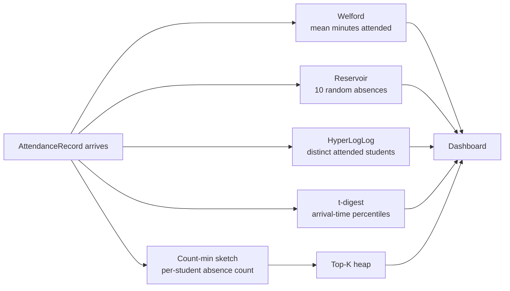

# 10 — Streaming Aggregation

Attendance data accumulates one record at a time, and we want stats — mean attendance rate, percentile lateness, top-k chronic absentees, distinct-student counts — without re-scanning history. This is the streaming algorithms chapter.

## The toolkit

| Question | Algorithm | Memory | Quality |
|----------|-----------|--------|---------|
| Running mean / variance | **Welford** | O(1) | Exact, numerically stable |
| Random sample of size k | **Reservoir sampling (Algorithm R)** | O(k) | Uniform |
| Top-k by frequency | **Count-min sketch** + heap | O(width × depth) | Approximate, one-sided |
| Distinct count | **HyperLogLog** | O(2^b) | ~1% error at b=14 |
| Percentiles (p50, p99) | **t-digest** | O(δ) | Sublinear, accurate at tails |

## Welford — the heart of every dashboard

For computing mean and variance of a stream `x_1, x_2, …, x_n` without storing the values and without losing precision:

$$M_n = M_{n-1} + \frac{x_n - M_{n-1}}{n}$$

$$S_n = S_{n-1} + (x_n - M_{n-1})(x_n - M_n)$$

$$\sigma_n^2 = \frac{S_n}{n} \quad \text{(population)}, \qquad s_n^2 = \frac{S_n}{n - 1} \quad \text{(sample)}$$

Why not the textbook $$\sigma^2 = E[X^2] - (E[X])^2$$? Because that subtracts two large nearly-equal numbers and loses precision catastrophically (the dreaded "catastrophic cancellation"). Welford never subtracts large quantities; the $$x_n - M_{n-1}$$ term is small.

```cpp
class WelfordAggregator {
    std::size_t n_ = 0;
    double mean_ = 0.0;
    double m2_ = 0.0;        // sum of squared deviations (S_n)
public:
    void add(double x) {
        ++n_;
        const double delta = x - mean_;
        mean_ += delta / static_cast<double>(n_);
        m2_   += delta * (x - mean_);
    }
    [[nodiscard]] double mean() const noexcept { return mean_; }
    [[nodiscard]] double variance() const noexcept {
        return n_ < 2 ? 0.0 : m2_ / static_cast<double>(n_ - 1);
    }
    [[nodiscard]] std::size_t count() const noexcept { return n_; }
};
```

Parallel-merge form (Chan's algorithm) lets you merge two `WelfordAggregator`s — useful if attendance is computed per-section in parallel and combined at the end. See `math/12-statistics.md` for the derivation.

## Reservoir sampling — show 10 random absences

Given a stream of unknown length, keep a uniform random sample of size `k`:

```text
function reservoir(stream, k):
    sample = first k items of stream
    i = k
    for each subsequent item x:
        i += 1
        j = uniform random in [0, i)
        if j < k:
            sample[j] = x
    return sample
```

Probability that any given item ends up in the sample: $$\frac{k}{n}$$ exactly. Memory: O(k). One pass, no rewinds. Use case: "show me 10 random instances where John was absent" without scanning the full record set.

## Count-min sketch — top-k chronic absentees

A 2D array `counts[depth][width]` plus `depth` independent hash functions. Insert: increment `counts[i][h_i(x) mod width]` for each row `i`. Query: minimum over rows.

Properties: never undercounts (only overestimates), error is $$\le \epsilon \cdot \|x\|_1$$ with probability $$1 - \delta$$ for `width = ⌈e/ε⌉`, `depth = ⌈ln(1/δ)⌉`.

For "top 10 students with the most absences across the last 4 terms": maintain a count-min sketch keyed by `studentId` (counter = # absences), and a min-heap of size 10 of the highest counts seen. Update both on each absence record. Memory: tens of KB, regardless of student count.

## HyperLogLog — distinct student count

"How many distinct students attended *any* class this term?" exact answer requires a hash set of all studentIds. HyperLogLog estimates this with `O(2^b)` bytes for `~ 1.04 / sqrt(2^b)` relative error.

Idea: hash each ID, count leading zeros in the hash; the maximum leading-zero count seen is logarithmic in the cardinality. Bucket by the high bits of the hash and harmonic-mean across buckets.

Setting `b = 14` gives 16 KB and ~0.8% error — plenty for "distinct students this term" reporting. See `math/14-information-theory.md` for the connection to entropy.

## t-digest — percentile attendance time

A hybrid clustering structure that compresses a stream into a small set of (centroid, weight) pairs concentrated near the tails (where percentile estimates are most useful). Memory: O(δ) where δ ≈ 100–200 typical. Estimates p50, p95, p99 with bounded relative error.

Use case: "what's the 95th-percentile arrival time for CS101 this term?" — a number we want without keeping every record's arrival time.

## Combining

A single attendance record fans out into all of these:



Each is O(1) per record. The whole stack costs maybe 100 ns per record on a modern CPU — comfortably faster than the network or DB write.

## Cross-references

- Where these aggregators live in the architecture — `02-architecture.md`
- Statistical foundations + confidence intervals on these estimates — `math/12-statistics.md`
- Information theory of entropy and cardinality — `math/14-information-theory.md`
