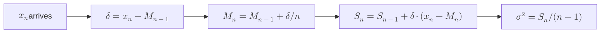

# 12 — Statistics

Statistical foundations for the attendance subsystem. Each tool is paired with a concrete query the registrar/dean actually wants answered.

## Welford's online mean and variance

**Why we need it.** "What's the mean attendance rate this term, updated as records arrive?" — without storing every record and without numerical drift.

**The recurrence.**

$$M_n = M_{n-1} + \frac{x_n - M_{n-1}}{n}$$

$$S_n = S_{n-1} + (x_n - M_{n-1})(x_n - M_n)$$

$$s_n^2 = \frac{S_n}{n - 1}$$

**Derivation sketch (sample variance).** From $$\sum (x_i - \bar{x})^2 = \sum x_i^2 - n \bar{x}^2$$, the naive online form requires $$\sum x_i^2$$ and $$\sum x_i$$ separately — both can grow large, and their difference at the end loses precision. Welford rewrites the update as a sum of small terms $$\delta_i = x_i - M_{i-1}$$, each near zero in magnitude.

**Worked example.** Three attendance percentages: 80, 90, 100.

| n | x_n | δ = x − M_{n−1} | M_n | S_n |
|---|-----|------------------|-----|-----|
| 1 | 80  | 80               | 80  | 0   |
| 2 | 90  | 10               | 85  | 50  |
| 3 | 100 | 15               | 90  | 200 |

Sample variance $$s^2 = 200/2 = 100$$, sample stdev $$s = 10$$.

**Parallel merge (Chan).** Two aggregators with $$(n_A, M_A, S_A)$$ and $$(n_B, M_B, S_B)$$ combine into $$(n, M, S)$$:

$$n = n_A + n_B, \quad \delta = M_B - M_A$$

$$M = M_A + \delta \cdot \frac{n_B}{n}$$

$$S = S_A + S_B + \delta^2 \cdot \frac{n_A n_B}{n}$$

This is what makes Welford composable across threads / sections / campuses.

---

## Wilson confidence interval on attendance rate

**Why we need it.** "Student X attended 8/10 classes — is that statistically different from 80%?" The naive Wald interval $$\hat{p} \pm z \sqrt{\hat{p}(1-\hat{p})/n}$$ misbehaves at small n and at $$\hat{p}$$ near 0 or 1 (it can produce intervals like $$[-0.05, 0.25]$$).

**Wilson form.** For confidence level with z-score $$z$$:

$$\text{CI} = \frac{\hat{p} + \frac{z^2}{2n} \pm z \sqrt{\frac{\hat{p}(1-\hat{p})}{n} + \frac{z^2}{4n^2}}}{1 + \frac{z^2}{n}}$$

Always within $$[0, 1]$$. Asymmetric near boundaries — which is correct, since $$\hat{p}=1$$ at $$n=10$$ shouldn't have a symmetric CI.

**Worked example.** $$\hat{p} = 0.8$$, $$n = 10$$, 95% confidence ($$z = 1.96$$):

Wilson 95% CI ≈ $$[0.49, 0.94]$$ — wide, honest. Wald CI would be $$[0.55, 1.05]$$ — clipped at 1, hides the true uncertainty.

---

## Paired t-test — did the intervention work?

**Setup.** Each student has attendance rates in two terms: before $$x_i$$ and after $$y_i$$ an intervention (advisor outreach, peer mentoring). Compute differences $$d_i = y_i - x_i$$, then test $$H_0: \mu_d = 0$$ vs $$H_1: \mu_d \ne 0$$.

$$t = \frac{\bar{d}}{s_d / \sqrt{n}}$$

Compare to $$t_{n-1, 1-\alpha/2}$$. Reject $$H_0$$ if $$|t|$$ exceeds the critical value.

**Caveat.** The t-test assumes $$d_i$$ are roughly normal. Attendance rates are bounded $$[0, 1]$$ and skewed near 1; an arcsine transform $$d_i' = \arcsin(\sqrt{y_i}) - \arcsin(\sqrt{x_i})$$ helps, or use a paired Wilcoxon signed-rank test (non-parametric).

---

## Bayesian beta-binomial — per-student attendance posterior

**Why we need it.** Frequentist rates ignore prior information. A student with $$0/1$$ attendance has $$\hat{p} = 0$$ — clearly silly given two extra weeks of context.

**Model.** Prior $$p \sim \text{Beta}(\alpha, \beta)$$ (e.g., $$\alpha = \beta = 1$$ uniform, or $$\alpha = 8, \beta = 2$$ for "we expect ~80% attendance"). Likelihood: $$k$$ presences out of $$n$$ classes is binomial. Posterior:

$$p \mid k, n \sim \text{Beta}(\alpha + k, \beta + n - k)$$

Posterior mean: $$\frac{\alpha + k}{\alpha + \beta + n}$$. With prior $$\alpha = 8, \beta = 2$$ and observed $$0/1$$, posterior mean is $$8/11 \approx 0.73$$ — much more reasonable than $$0$$.

**Connection to Wilson.** The Wilson CI is closely related to the credible interval of a Beta posterior with a specific prior; see Brown-Cai-DasGupta (2001).

---

## Cross-references

- Welford implementation — `algorithms/10-streaming-aggregation.md`
- Probability distributions used here — `13-probability.md`
- Information-theoretic measures of attendance distribution — `14-information-theory.md`
