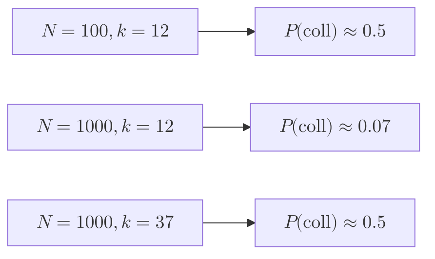
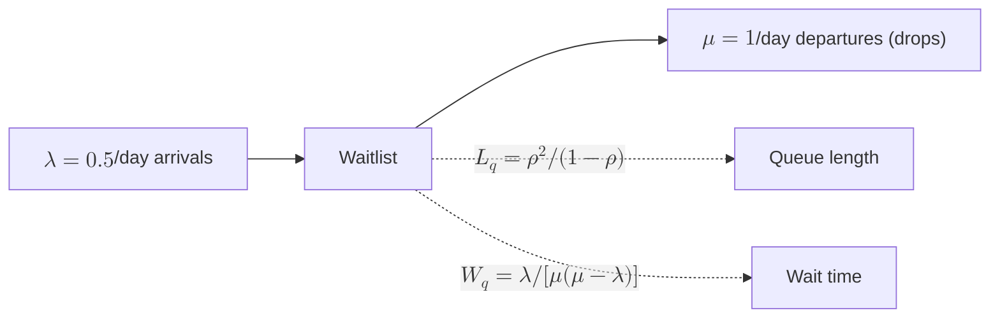

# 13 — Probability

The probability tools we actually use: birthday paradox (collision math), Poisson processes (waitlist arrivals), M/M/1 queueing (expected wait), geometric distribution (drop-out modeling).

## Birthday paradox — email collision math

**The question.** Email format is `{campusCode}_{firstInitial}{lastName}{last2digitsEmpId}@{domain}`. With `~50,000` students per campus and the last-2 digits of `employeeId` providing 100 distinct suffixes per `(firstInitial, lastName)` bucket, what's the probability of a collision?

**Setup.** For a bucket with $$N$$ slots (here $$N = 100$$) and $$k$$ items inserted, probability of *no* collision:

$$P(\text{no collision}) = \prod_{i=0}^{k-1} \left(1 - \frac{i}{N}\right) \approx e^{-k(k-1)/(2N)}$$

Collision probability for $$k$$ items:

$$P(\text{collision}) \approx 1 - e^{-k^2 / 2N}$$

The "birthday" point — 50% collision probability:

$$k_{50\%} \approx \sqrt{2N \ln 2} \approx 1.177 \sqrt{N}$$

For $$N = 100$$: $$k_{50\%} \approx 12$$. **Twelve students with the same initial+lastname is enough for a coin-flip collision.** "John Smith" has more than 12 instances at any large CUNY campus.

**Decision.** Switch suffix from last-2 to last-3 digits. $$N = 1000$$ → $$k_{50\%} \approx 37$$. Still possible; pair with a collision-detection-and-renumber fallback ("if `jsmith_341` exists, try `jsmith2_341`").

**General form.** For desired collision probability $$p$$:

$$k(p, N) \approx \sqrt{2 N \ln \tfrac{1}{1-p}}$$

---

## Poisson process — waitlist arrivals

**Model.** Students join a waitlist independently with average rate $$\lambda$$ per unit time. The number of arrivals in time $$T$$:

$$P(N_T = k) = \frac{(\lambda T)^k e^{-\lambda T}}{k!}$$

Inter-arrival times are exponential:

$$P(\tau \le t) = 1 - e^{-\lambda t}$$

**Use.** "Given $$\lambda = 0.5$$ joins/hour to the CS101 waitlist, what's the probability of 5+ joins in the first day of registration?"

$$P(N_{24} \ge 5) = 1 - \sum_{k=0}^{4} \frac{12^k e^{-12}}{k!} \approx 0.998$$

Practically certain.

---

## M/M/1 queue — expected wait time

**Model.** Poisson arrivals at rate $$\lambda$$ ("students join waitlist"); exponential service at rate $$\mu$$ ("seats free up"); single server (one course); FIFO.

**Stability requires** $$\rho := \lambda / \mu < 1$$. Otherwise the queue grows without bound.

**Steady-state expected wait** (in queue, not counting service):

$$W_q = \frac{\rho}{\mu - \lambda} = \frac{\lambda}{\mu(\mu - \lambda)}$$

**Steady-state expected number in queue:**

$$L_q = \frac{\rho^2}{1 - \rho}$$

**Worked example.** A 40-seat CS101. After registration locks, drops occur at $$\mu = 1/\text{day}$$ (Poisson). Students keep joining the waitlist at $$\lambda = 0.5/\text{day}$$. Then $$\rho = 0.5$$:

$$L_q = \frac{0.25}{0.5} = 0.5 \text{ students queued on average}$$

$$W_q = \frac{0.5}{1 \cdot 0.5} = 1 \text{ day expected wait}$$

Decent. If $$\lambda \to \mu$$, the wait explodes — that's a sign the course is structurally under-capacity.

---

## Geometric distribution — drop-out modeling

**Model.** A student enrolls in a course. Each week, with probability $$q$$ independently, they drop. The week of dropping (if it happens) follows:

$$P(\text{drop in week } k) = q (1 - q)^{k-1}$$

$$P(\text{still enrolled after } k \text{ weeks}) = (1 - q)^k$$

**Use.** Estimate $$q$$ from historical attendance data; predict end-of-term drop counts:

$$E[\text{drops by week } k] = n_0 \cdot \big(1 - (1 - q)^k\big)$$

The geometric distribution is memoryless — a student who hasn't dropped by week 5 has the same probability of dropping in week 6 as a fresh enrollee. This is the *modeling assumption*; in reality, drop probability spikes around midterms. For richer modeling, hazard-rate models (Cox proportional hazards) are next-step.

---

## Cross-references

- Email format design — `03-domain-model.md`
- Waitlist data structures — `algorithms/09-waitlist-queues.md`
- Confidence intervals on these estimates — `12-statistics.md`
