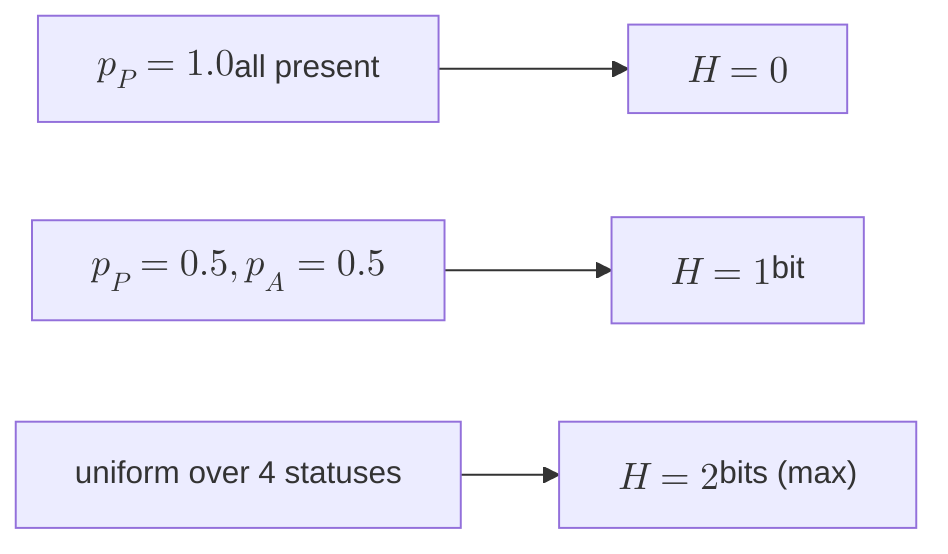

# 14 — Information Theory

Information-theoretic measures applied to the attendance and enrollment data: Shannon entropy, KL divergence, mutual information, Huffman coding.

## Shannon entropy — diversity of attendance patterns

**Definition.** For a discrete distribution $$p_1, p_2, \ldots, p_k$$ with $$\sum p_i = 1$$:

$$H(X) = -\sum_{i=1}^{k} p_i \log_2 p_i$$

Units are bits (using log base 2). $$H(X)$$ is maximized when $$X$$ is uniform — value $$\log_2 k$$. It's zero when $$X$$ is deterministic.

**Use case.** Categorize a class meeting's attendance into four buckets: PRESENT, ABSENT, TARDY, EXCUSED. A class where everyone is present has $$H = 0$$. A class with a 50/50 mix of present/absent has $$H = 1$$. The full four-way distribution caps at $$H = 2$$.

A high-entropy attendance distribution across a term suggests an unstable, high-variance class. A *changing* entropy over time (decreasing) suggests intervention is working.

**Worked example.** A class of 40 students: 30 present, 5 tardy, 5 absent.
$$p = (0.75, 0.125, 0.125)$$. 
$$H = -(0.75 \log_2 0.75 + 0.125 \log_2 0.125 + 0.125 \log_2 0.125)$$ 
$$= -(0.75 \cdot -0.415 + 0.125 \cdot -3 + 0.125 \cdot -3) \approx 1.06 \text{ bits}$$.

---

## KL divergence — semester-over-semester drift

**Definition.** For distributions $$P$$ (this term) and $$Q$$ (last term) over the same support:

$$D_{KL}(P \,\|\, Q) = \sum_i p_i \log_2 \frac{p_i}{q_i}$$

$$D_{KL} = 0$$ iff $$P = Q$$. It's not symmetric: $$D_{KL}(P \| Q) \ne D_{KL}(Q \| P)$$ in general. It's not a metric (no triangle inequality).

**Interpretation.** Average extra bits needed to encode samples from $$P$$ using a code optimized for $$Q$$. In our context: how surprising is this term's attendance distribution given last term's pattern?

**Caveat.** Undefined when any $$q_i = 0$$ but $$p_i > 0$$. Use Laplace smoothing: $$q_i' = (q_i + \epsilon) / (1 + k\epsilon)$$ for some small $$\epsilon$$.

**Use case.** Detect a section that's drifting away from its historical pattern. High $$D_{KL}$$ → flag for advisor review.

---

## Mutual information — co-attendance signal

**Definition.** For two random variables $$X$$ (attendance in CS101) and $$Y$$ (attendance in CS102):

$$I(X; Y) = \sum_{x,y} p(x,y) \log_2 \frac{p(x,y)}{p(x)\, p(y)} = D_{KL}(p(x,y) \,\|\, p(x) p(y))$$

$$I(X; Y) = 0$$ iff $$X \perp Y$$ (independent). Larger values indicate dependence.

**Use case — recommendation hint.** High mutual information between two courses' attendance patterns suggests students who attend one tend to attend the other (or both struggle when one does). Useful as a feature for "students who took X also took Y" recommenders. Cleaner than raw correlation when the relationship is non-linear.

**Decomposition (chain rule).** $$H(X, Y) = H(X) + H(Y \mid X)$$, and $$I(X; Y) = H(X) + H(Y) - H(X, Y) = H(Y) - H(Y \mid X)$$.

---

## Huffman coding — student-id compression

**The problem.** Cold-storage of historical enrollment records. `studentId` is a 32-bit integer, but the *active* set of student IDs in a given term is heavily skewed (some IDs reappear across many records, some only once).

**Huffman idea.** Build a binary tree where frequent symbols get short codes. The expected code length is bounded:

$$H(X) \le L_{\text{Huffman}} < H(X) + 1$$

i.e., Huffman is within one bit per symbol of the entropy lower bound (Shannon's source coding theorem).

**Algorithm.** Maintain a priority queue of (frequency, subtree) pairs. Repeatedly pop the two smallest, merge into a parent (frequency = sum), push back. Terminates when one tree remains. Time: O(n log n).

**Use case.** A CS101 with a stable cohort of 40 students generating 1120 attendance records will compress the studentId field from 32 bits/record to ~6 bits/record (since there are only 40 distinct values, $$\log_2 40 \approx 5.3$$, plus overhead). Not transformative; nice if cold storage is metered by GB.

**Better in practice.** For sequences (not single symbols), arithmetic coding or zstd dictionary-mode compresses farther — 2-3x over Huffman on real data. Huffman is mostly here because it's the cleanest pedagogical link from $$H(X)$$ to a real algorithm.

---

## Connection to HyperLogLog

The intuition behind HyperLogLog (`algorithms/10-streaming-aggregation.md`) is information-theoretic: each hashed item contributes $$\log_2 n$$ bits of "novelty" to the running estimate. The maximum number of leading zeros in a stream of hashes is roughly $$\log_2 n$$, which is why a register holding the max-leading-zero count needs only $$\log_2 \log_2 n$$ bits per bucket.

---

## Cross-references

- Streaming distinct counts (HLL) — `algorithms/10-streaming-aggregation.md`
- Statistical hypothesis testing — `12-statistics.md`
- Combinatorial enumeration of distinct patterns — `15-combinatorics.md`
