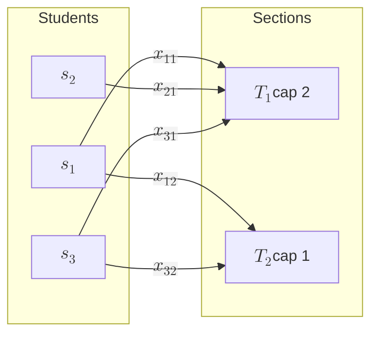

# 16 — Optimization

Linear programming, min-cost flow, Hungarian algorithm, integer programming, and the simulated-annealing escape hatch — applied to capacity allocation, section assignment, and TA matching.

## Linear programming — seat-capacity allocation

**The problem.** Allocate students to course sections. Each student `i` has demand `d_i ∈ {0, 1}` per course. Each section `j` has capacity `c_j`. Maximize total enrollments subject to capacity and (optionally) prereq satisfaction.

**LP formulation.** Decision variables $$x_{ij} \in [0, 1]$$ (relax integrality first).

$$\max \sum_{i,j} x_{ij}$$

$$\text{s.t.} \quad \sum_{j} x_{ij} \le 1 \quad \forall i \quad \text{(each student in $\le$1 section per course)}$$

$$\sum_{i} x_{ij} \le c_j \quad \forall j \quad \text{(capacity)}$$

$$x_{ij} \le \mathbf{1}[i \text{ has prereqs for } j]$$

**Solving.** Simplex (worst-case exponential, average linear); interior-point methods (polynomial). For the sizes we care about (thousands of students, hundreds of sections), simplex via `glpk` or `CLP` solves in milliseconds.

**Integrality gap.** The LP relaxation may give $$x_{ij} = 0.5$$. For our problem, the constraint matrix is **totally unimodular** (it's an instance of bipartite matching / transportation), so the LP optimum is automatically integral — no IP needed. This is a major piece of luck.



---

## Min-cost max-flow — student → section, with preferences

**Generalization.** Each $$x_{ij}$$ has a cost $$w_{ij}$$ (preference: student's ranking, prereq strength, time-of-day fit). Maximize matched count first; among optima, minimize total cost.

**Network.** Source `s` → each student (capacity 1) → each compatible section (capacity 1, cost $$w_{ij}$$) → sink `t` (with section→sink capacity = section capacity).

**Algorithms.**

- **Successive shortest paths** with Bellman-Ford / SPFA: O(VE × maxflow).
- **SSP with potentials** (Johnson reweighting + Dijkstra): O((V + E) log V × maxflow).
- **Network simplex**: fast in practice; the choice in `OR-tools`.

For ~10⁴ students × ~10² sections, all of these are fast.

---

## Hungarian algorithm — TA → course matching

**The problem.** $$n$$ TAs and $$n$$ courses (or padded with dummies); each TA has a cost $$w_{ij}$$ for each course (skill mismatch, time conflict, preference inversion). Find a perfect matching minimizing total cost.

**Algorithm.** $$O(n^3)$$ via the Kuhn-Munkres/Hungarian method. Two phases: dual-update phase to expose tight edges, primal augmentation along an augmenting path in the equality subgraph.

**Why not min-cost flow?** Hungarian is specialized for the assignment problem (exactly $$n$$ on each side, perfect matching) and has a much smaller constant. Min-cost flow generalizes but pays for it.

**Use case.** Match the term's available TAs to the courses needing TAs, minimizing total mismatch cost. Cost weights encode "this TA has taken this course before" (low cost) vs "this TA hasn't seen the material" (high cost).

---

## Integer programming — term schedule generation

**Generalization.** Produce a schedule (which sections, what time slots, which rooms) subject to:
- Room capacities
- Faculty availability
- No-overlap constraints
- Demand-driven minima (CS101 must offer enough seats)

**Form.** $$x_{srt} \in \{0, 1\}$$: section $$s$$ in room $$r$$ at time $$t$$. Constraints become:

$$\sum_{r, t} x_{srt} = 1 \quad \forall s \quad \text{(each section scheduled exactly once)}$$

$$\sum_{s} x_{srt} \le 1 \quad \forall r, t \quad \text{(no double-booking)}$$

$$\sum_{r, t \in T_f} x_{srt} \le 1 \quad \forall f, \text{ section } s \text{ taught by } f \quad \text{(faculty conflict)}$$

**Hardness.** General IP is NP-hard. For modest problem sizes, branch-and-bound (CPLEX, Gurobi, SCIP) solves in seconds. For the CUNY-scale problem, decompose by department first (small subproblems).

---

## Simulated annealing — when nothing else works

**Use.** When the problem is too irregular to fit LP/IP cleanly (e.g., soft constraints with non-linear penalties, like "minimize student walking distance between consecutive classes"), simulated annealing is a respectable escape hatch.

**Algorithm.** Maintain a current solution. Each step: propose a small perturbation (swap two sections' time slots). Compute energy change $$\Delta E$$ (cost difference). Accept always if $$\Delta E < 0$$; otherwise accept with probability $$e^{-\Delta E / T}$$. Cool $$T$$ over time.

**Strengths.** Simple to implement, provides anytime answers, escapes local optima. **Weaknesses.** No optimality bound, hyperparameters (cooling schedule) matter a lot.

```mermaid
graph TB
    Init[Initial schedule] --> Prop[Propose swap]
    Prop --> Eval["$$\Delta E$$ = cost diff"]
    Eval -->|"$$\Delta E < 0$$"| Acc[Accept]
    Eval -->|"$$\Delta E \ge 0$$"| Coin{"$$\text{rand} < e^{-\Delta E / T}$$ ?"}
    Coin -->|yes| Acc
    Coin -->|no| Rej[Reject]
    Acc --> Cool[Cool T slowly]
    Rej --> Cool
    Cool --> Prop
```

---

## 2-SAT for OR-group satisfiability

Cross-link to `algorithms/06-prerequisite-graph.md`. Given OR-groups in the prereq DAG plus mutual-exclusion constraints (you can't take CS301 and CS302 in the same term), check satisfiability via Tarjan's SCC on the implication graph: O(V + E). The check is in P; the optimization (minimize number of terms) is harder, but small enough for IP.

---

## Cross-references

- Bipartite matching algorithms (Hopcroft-Karp) — `17-linear-algebra-graphs.md`
- Constraint expression in code (concepts, ranges) — `conventions/18-cpp-style.md`
- Solver libraries to bind (or-tools, scipy.optimize) — `interop/22-exposed-api.md`
