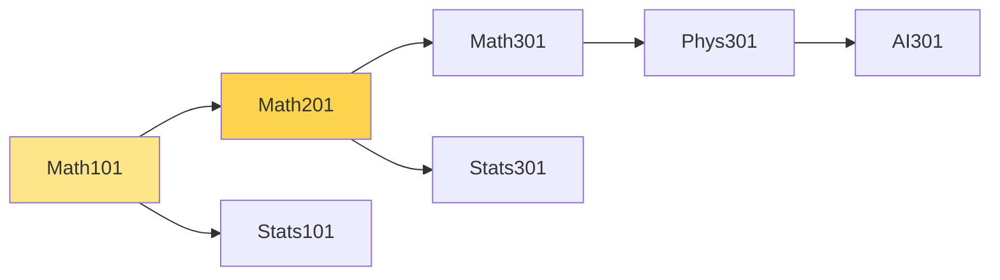

# 17 — Linear Algebra & Graph Theory

The matrix view of the prereq DAG, PageRank-style course importance, spectral clustering of curricula, bipartite matching for student-section assignment, max-flow for over-subscribed terms.

## Adjacency matrix view

The prereq DAG has $$n$$ courses; let $$A$$ be the $$n \times n$$ binary matrix with $$A_{ij} = 1$$ iff $$j$$ is a direct prereq of $$i$$.

**Powers count paths.** $$(A^k)_{ij}$$ = number of length-$$k$$ paths from $$j$$ to $$i$$. The transitive closure is given by $$\sum_{k=1}^{n} A^k$$, computable as $$(I - A)^{-1} - I$$ over a suitable ring (or by Boolean matrix multiplication for the binary version).

**Sparsity.** Real prereq DAGs are sparse: each course has $$O(1)$$ prereqs. So $$A$$ has $$O(n)$$ non-zeros, and Floyd-Warshall's $$O(n^3)$$ is wasteful for the binary closure — DFS-from-each-node is $$O(n \cdot (V+E)) = O(n^2)$$.

---

## PageRank-style course importance

**Question.** Which courses are *centrally* important in the curriculum graph? Not just by raw fan-out, but recursively: a course that's a prereq for many *important* courses is itself important.

**Formulation.** Random walk on the DAG (with reset probability $$\alpha$$). Let $$\mathbf{r} \in \mathbb{R}^n$$ be the rank vector. Let $$M$$ be the column-normalized adjacency matrix (out-edges). Then

$$\mathbf{r} = (1 - \alpha) M \mathbf{r} + \alpha \cdot \tfrac{1}{n} \mathbf{1}$$

Solve via power iteration: $$\mathbf{r}^{(k+1)} = (1 - \alpha) M \mathbf{r}^{(k)} + \alpha \cdot \tfrac{1}{n} \mathbf{1}$$, converges in $$O(\log_\alpha \epsilon)$$ iterations.

**Use case.** Rank introductory courses by curricular impact. CS101 will rank highly because it's the prereq for a long downstream tree. A specialty elective with no dependents ranks low.

In this snippet, Math101 has the highest PageRank (everything traces back to it).

---

## Spectral clustering — natural curriculum tracks

**Question.** Are there natural sub-curricula? CS-systems vs CS-theory? Applied math vs pure math?

**Approach.** Compute the graph Laplacian $$L = D - A$$ (where $$D$$ is the degree matrix). Find the smallest non-zero eigenvalues' eigenvectors of $$L$$. Each eigenvector gives a soft node clustering; sign of the second-smallest eigenvector (the *Fiedler vector*) gives a 2-cluster split.

**Properties.**
- $$L$$ is symmetric positive semi-definite.
- The smallest eigenvalue is $$0$$ (with eigenvector $$\mathbf{1}$$).
- The number of zero eigenvalues = number of connected components.
- The second-smallest (Fiedler value) measures algebraic connectivity.

**Use case.** Run k-means on the bottom-$$k$$ eigenvectors to assign each course to one of $$k$$ tracks. Useful for advising ("you've been taking the systems track, here's what comes next").

---

## Bipartite matching — Hopcroft-Karp

**Setup.** Students on one side, sections on the other. Edges represent compatibility (prereq met, time fits). Find a maximum matching.

**Hopcroft-Karp.** $$O(E \sqrt{V})$$ — better than the naive augmenting-path matching's $$O(VE)$$. Phases: a BFS layers the graph, then a DFS finds vertex-disjoint augmenting paths in the layered graph.

**Use case.** "Maximize the number of students who get into a section they need." Once matching is solved, leftover students go on waitlists.

---

## Max-flow — over-subscribed terms

**Setup.** Source → students → sections → sink. Edge capacities are 1 (each student takes one section per course) or section capacity (sink edge). Max flow = max enrollments.

**Algorithms.**

| Algorithm | Complexity | Notes |
|-----------|------------|-------|
| Ford-Fulkerson with BFS (Edmonds-Karp) | $$O(V E^2)$$ | Pedagogical baseline |
| Dinic's | $$O(V^2 E)$$ general; $$O(E \sqrt{V})$$ for unit-capacity bipartite | Practical workhorse |
| Push-relabel (FIFO, highest-label) | $$O(V^3)$$ | Good for dense graphs |
| Goldberg-Rao | $$O((VE)^{2/3} E \log(V^2/E))$$ or so | Theoretical best in practice |

For unit-capacity bipartite (which is the student-section case), Dinic's reduces to Hopcroft-Karp.

**Min-cut connection.** Max-flow = min-cut (Ford-Fulkerson theorem). The min-cut tells you which capacity bottleneck is binding — useful for "where do we need more sections?"

---

## Matrix-tree theorem (sidebar)

For a connected undirected graph, the number of spanning trees equals any cofactor of the Laplacian:

$$\tau(G) = \det(L_0)$$

where $$L_0$$ is $$L$$ with one row and column deleted. Mostly trivia for our domain — but if we ever model "alternate prerequisite chains" as spanning trees of a fully-connected DAG variant, this is the count.

---

## Cross-references

- Sparse matrix data structures in C++ (`Eigen::SparseMatrix`) — `conventions/18-cpp-style.md`
- NumPy bridging for Python-side spectral analysis — `interop/23-python-driver.md`
- Min-cost flow extension — `16-optimization.md`
