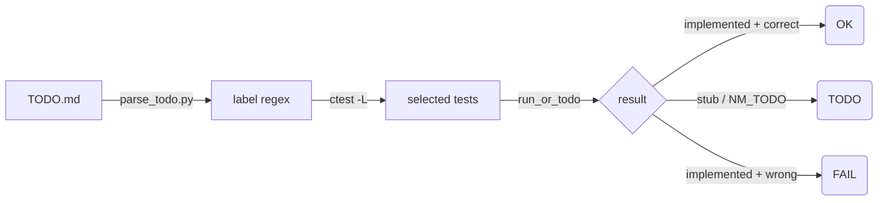
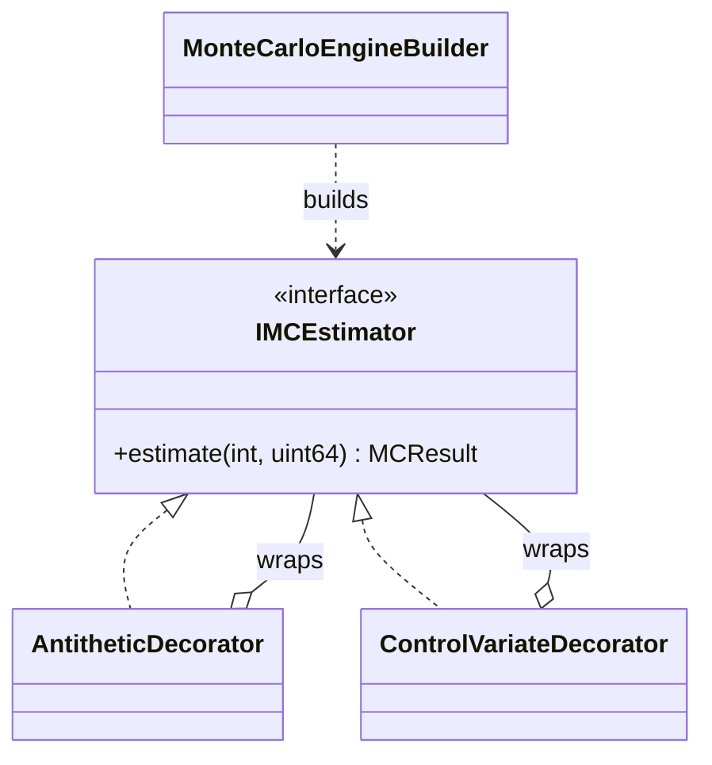
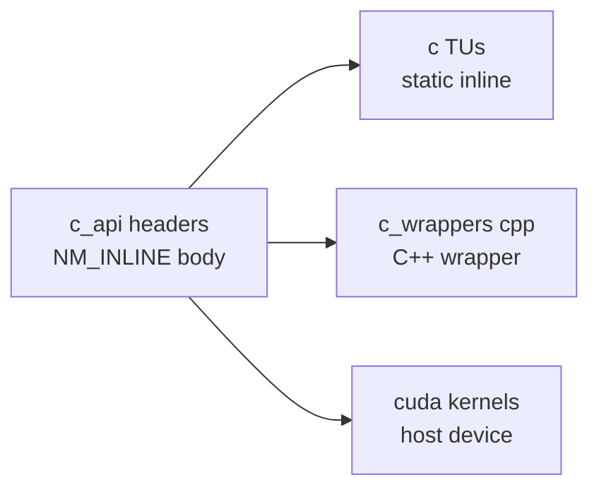
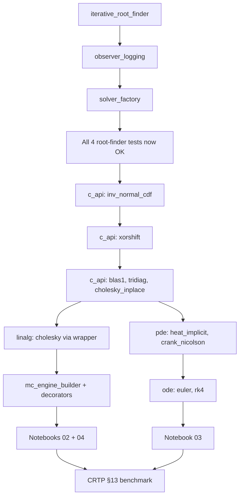

# Numerical Methods Roadmap (checkbox-gated)

Each `- [ ]` line is an implementable item with a unique `<slug>`. **Check the
box (`- [x]`) when you've finished an item** — CI runs only the tests for
checked items (plus the always-on `baseline` tests). The slug between `**` is
the ctest label that gets pulled in.

## Legend
- `[ ]` not started
- `[x]` claimed done — CI tests it on next push
- `(stretch)` optional / advanced
- math is in $\KaTeX$ (renders on github.com); diagrams use Mermaid

## How CI gating works

If a test is `[ OK ]` you've earned it; if it's `[FAIL]` your implementation
disagrees with the test. `[TODO]` keeps CI green so you can mark items
"in progress" without blocking the whole pipeline.

---

## §1 Root finding — Strategy / Template Method / Observer

**Working today (ported from procedural API):**

- [x] **bisection** — Bracketing; $|e_{k+1}| = \tfrac12|e_k|$. `BisectionSolver`. Test: `test_bisection`.
- [x] **newton** — Quadratic: $x_{n+1} = x_n - \dfrac{f(x_n)}{f'(x_n)}$. `NewtonSolver`. Test: `test_newton`.
- [x] **secant** — Order $\varphi \approx 1.618$. `SecantSolver`. Test: `test_secant`.
- [x] **brent** — Bracketed IQI + bisection safeguard. `BrentSolver`. Test: `test_brent`.

**Pattern infrastructure (you implement first):**

- [ ] **iterative_root_finder** — Template Method: implement `IterativeRootFinder::solve()` (the loop in `src/patterns/iterative_root_finder.cpp`). Without this, every solver above just throws `not_implemented`. Test: `test_iterative_method`.
- [ ] **observer_logging** — Implement `LoggingObserver`, `CapturingObserver`, `EarlyStopObserver` bodies. Test: `test_observer`.
- [ ] **solver_factory** — Implement `SolverFactory::create()` switch. Test: `test_factory`.

**New methods (extend with the same pattern):**

- [ ] **halley** — Cubic: $x_{n+1} = x_n - \dfrac{2 f f'}{2(f')^2 - f f''}$. References: Wikipedia "Halley's_method". Test: `test_root_finders_extra`.
- [ ] **ridders** — NR3 §9.2.1; exponential transform on false-position. Test: `test_root_finders_extra`.
- [ ] **muller** — NR3 §9.5.2; quadratic fit through 3 points. Test: `test_root_finders_extra`.
- [ ] **chandrupatla** — Modern Brent variant (Chandrupatla 1997). Test: `test_root_finders_extra`.

## §2 Quadrature

- [ ] **romberg** — Trapezoid + Richardson extrapolation. NR3 §4.3. Test: `test_quadrature`.
- [ ] **adaptive_simpson** — Recursive split where Simpson disagrees. NR3 §4.7. Test: `test_quadrature`.
- [ ] **gauss_legendre** — Polynomial-exact for degree $\le 2n-1$. NR3 §4.6. Test: `test_quadrature`.
- [ ] **gauss_hermite** — $\int_{-\infty}^{\infty} e^{-x^2} g(x)\,dx$. **Quant**: every $\mathbb E[g(Z)]$ under $Z \sim \mathcal N(0,1)$. Test: `test_quadrature`.
- [ ] **tanh_sinh** — Endpoint-singularity-tolerant. Bailey & Borwein. Test: `test_quadrature`.

## §3 Differentiation

- [ ] **richardson_derivative** — Richardson extrapolation on central differences. Test: `test_differentiation`.
- [ ] **complex_step_derivative** — $f'(x) \approx \dfrac{\Im\big(f(x+ih)\big)}{h}$, no cancellation. **Quant**: clean Greeks from a templated pricer. Test: `test_differentiation`.

## §4 ODE

- [ ] **euler** — Forward Euler, conditionally stable. Test: `test_ode`.
- [ ] **rk4** — Classical 4-stage Runge-Kutta, $\mathcal{O}(h^5)$ local error. Test: `test_ode`.
- [ ] **rk45** — Dormand-Prince adaptive 4(5) pair. NR3 §17.2. Test: `test_ode`.

## §5 Linear algebra

- [ ] **lu_decompose** — Partial-pivoted LU; `LU` struct. NR3 §2.3. Test: `test_linalg`.
- [ ] **cholesky** — $A = L L^\top$ for SPD. The wrapper in `src/c_wrappers/cholesky_wrapper.cpp` calls `c_api/cholesky_inplace.h`. **Quant**: correlated normal sampling, $Y = L Z$. Test: `test_linalg`.
- [ ] **qr_decompose** — Modified Gram-Schmidt. Test: `test_linalg`.
- [ ] **conjugate_gradient** — Iterative SPD solver. Pair with `csr_sparse` for the real demo. Test: `test_linalg`.

## §6 Optimization

- [ ] **golden_section** — 1-D, derivative-free; ratio $\varphi$. Test: `test_optimization`.
- [ ] **brent_min** — 1-D, golden + parabolic. NR3 §10.3. Test: `test_optimization`.
- [ ] **nelder_mead** — n-D simplex. NR3 §10.5. Test: `test_optimization`.
- [ ] **levenberg_marquardt** — Nonlinear least-squares: $(J^\top J + \lambda \,\mathrm{diag}(J^\top J))\,\Delta x = -J^\top r$. **Quant**: SABR/Heston/SVI calibration. NR3 §15.5. Test: `test_optimization`.

## §7 Random / Monte Carlo

- [ ] **box_muller** — Two $U(0,1) \to$ two $\mathcal N(0,1)$. Test: `test_random_mc`.
- [ ] **inv_normal_cdf** — Acklam $\Phi^{-1}$. Required for Sobol-MC. Lives in `c_api/inv_normal_cdf.h` as a shared C/CUDA function. Test: `test_random_mc`, `test_c_api`.
- [ ] **sobol_1d** — Van der Corput in base 2. Test: `test_random_mc`.

## §8 Interpolation

- [ ] **natural_cubic_spline** — $S''(x_0) = S''(x_n) = 0$. NR3 §3.3. Test: `test_interpolation`.
- [ ] **monotone_cubic** — Hyman/Steffen filter. **Quant**: yield-curve construction (Hagan & West). Test: `test_interpolation`.
- [ ] **pchip** — Fritsch-Carlson piecewise cubic Hermite. Test: `test_interpolation`.

## §9 PDE — finite differences

- [ ] **heat_explicit** — FTCS, stable iff $\nu\Delta t / \Delta x^2 \le 1/2$. **CUDA-friendly**. Test: `test_pde`.
- [ ] **heat_implicit** — Backward Euler; tridiagonal solve via `dsa::solve(Tridiag, rhs)`. Test: `test_pde`.
- [ ] **crank_nicolson** — $\mathcal{O}(\Delta t^2)$, unconditionally stable. **Quant**: standard for PDE option pricing. Test: `test_pde`.

## §10 Monte Carlo engine — Builder + Decorator

- [ ] **mc_engine_builder** — `build()` validates: payoff required, n_paths > 0, control-variate complete. Throws `std::invalid_argument` on misuse. Test: `test_mc_builder`.
- [ ] **antithetic_decorator** — Pair $(Z, -Z)$; halves variance for monotone payoffs. Test: `test_decorators`.
- [ ] **control_variate_decorator** — $X' = X - \hat\beta(Y - \mu_Y)$. Glasserman ch. 4. Test: `test_decorators`.

## §11 Pure-C primitives (with `NM_INLINE` C/CUDA sharing)

The same algorithm body runs on CPU (in a `.c` TU), inside a CUDA `__device__`
kernel, and behind the C++ API. One source of truth.

- [ ] **xorshift** — `xorshift64_next` step. Test: `test_c_api`, `test_c_api_pure`.
- [ ] **inv_normal_cdf** — Acklam rational approximation. Test: `test_c_api`, `test_c_api_pure`.
- [ ] **blas1** — `nm_saxpy`, `nm_dot`, `nm_scale`. `__restrict__` for autovectorization. Test: `test_c_api`, `test_c_api_pure`.
- [ ] **tridiag** — Thomas algorithm. Used by `pde::heat_implicit`, `pde::crank_nicolson`. Test: `test_c_api`, `test_c_api_pure`.
- [ ] **cholesky_inplace** — Small (n ≤ 16) in-place Cholesky. Used by `nm::linalg::cholesky` AND `cuda/cholesky_batch.cu`. Test: `test_c_api`, `test_c_api_pure`.

## §12 CUDA challenges (consume the C primitives)

- [ ] **cuda_monte_carlo_paths** — `cuda/monte_carlo_paths.cu` calls `xorshift64_next` + `nm_inv_normal_cdf` from `__device__` code. Each thread = one path.
- [ ] **cuda_cholesky_batch** — `cuda/cholesky_batch.cu` calls `nm_cholesky_inplace` per block.
- [ ] **cuda_pde_heat** — `cuda/pde_heat_explicit.cu` — kernel-native (FTCS is embarrassingly parallel).
- [ ] **cuda_vector_ops** — `cuda/vector_ops.cu` uses `c_api/blas1.h` from `__device__` code.

CUDA tests aren't in ctest by default (no GPU on most CI runners). The `cuda` job
in `.github/workflows/ci.yml` runs as best-effort with `continue-on-error: true`.

## §13 (stretch) CRTP vs virtual dispatch

- [ ] **crtp_bisection** — `CRTPBisection` is already implemented in `include/patterns/crtp_root_finder.h`; this checkbox marks "I've understood the difference and run the benchmark". Test: `test_crtp_dispatch`.

The microbenchmark prints both timings; expected speedup is 3-10× on `-O2`.

## §14 Data structures and algorithms

Targeted DSA additions where they materially improve a numerical method.

- [ ] **error_heap** — Min-heap (max by `error_est`) for adaptive Simpson's subinterval queue. `O(\log n)` pop-max-error. Test: `test_error_heap`.
- [ ] **tridiag_struct** — Strongly-typed `Tridiag` wrapping (sub, diag, super). Calls `nm_thomas_solve` from `c_api/tridiag.h`. Test: `test_tridiag`.
- [ ] **csr_sparse** — Compressed Sparse Row + sparse matvec. Pairs with `conjugate_gradient` to make CG real. Test: `test_csr`.
- [ ] **bit_reverse** — Bit-reversal permutation, prerequisite for FFT. Test: `test_fft`.
- [ ] **fft** *(stretch)* — Cooley-Tukey radix-2. **Quant**: Carr-Madan FFT pricing of European options under any model with a known characteristic function. Test: `test_fft`.

## §15 Python / Jupyter frontend

Notebooks live in `notebooks/` and consume the `nmpy` pybind11 module
(build with `cmake -DNM_USE_PYTHON=ON`).

- [ ] **nb_root_finding** — `notebooks/01_root_finding.ipynb` — convergence-rate plots using `CapturingObserver`.
- [ ] **nb_monte_carlo** — `notebooks/02_monte_carlo.ipynb` — MC engine variance comparison.
- [ ] **nb_pde_pricing** — `notebooks/03_pde_pricing.ipynb` — heat equation $\to$ Black-Scholes price surface.
- [ ] **nb_calibration** — `notebooks/04_calibration.ipynb` — Levenberg-Marquardt vol-smile fit.

---

## Suggested implementation order

Each green node is a checkmark. CI gates everything else. By node `N`,
you've built a coherent mini-quant-numerics library in C, C++, and (with
`NM_USE_CUDA=ON`) CUDA, fronted by Python/Jupyter.
