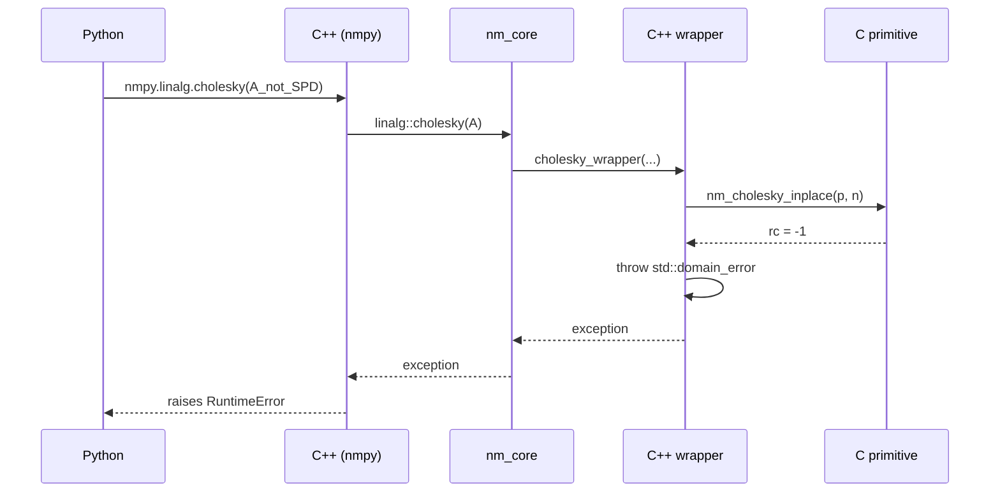

# Error handling philosophy

This repo uses **different error-handling strategies in different languages**,
matching the idioms of each. The boundaries are intentional — crossing them
is where bugs live.

## C: return-code errors

```c
/* c_api/cholesky_inplace.h */
NM_INLINE int nm_cholesky_inplace(double* A, int n) {
    /* returns 0 on success, -1 if A is not SPD or n is out of range */
}
```

C functions:

- Return `int` (or another sentinel type) for status: 0 = ok, negative = error.
- Output values via pointer arguments.
- **Don't** use `errno` (thread-safety pain on some platforms).
- **Don't** `printf` or `abort` from a library function — that's the caller's
  call.

Why: C has no exceptions. CUDA `__device__` code can't throw at all. Return
codes work uniformly across both targets, and the caller gets to decide what
to do (retry, fall back, propagate).

Test pattern (see `tests/test_c_api.cpp`):

```cpp
int rc = nm_cholesky_inplace(A, 2);
NM_TODO_IF(rc == -1 && A[0] == 4.0, "nm_cholesky_inplace");  // unimplemented
NM_CHECK(rc == 0);  // SPD path: must succeed
```

## C++: exceptions for algorithmic failures, result struct for convergence failures

The distinction matters:

- **Exceptional conditions** — caller did something wrong, or a precondition
  is violated. Throw.
  - Non-SPD matrix passed to `cholesky` → `std::domain_error`
  - Bad input to a builder → `std::invalid_argument`
  - Method not yet implemented → `nm::not_implemented` (caught by tests)
- **Convergence failure** — the algorithm ran legally but couldn't reach
  tolerance in `max_iter`. That's *data*, not an exception. Returned in the
  result struct:

```cpp
struct ConvergenceResult {
    double root;
    int iterations;
    bool converged;          // ← convergence is data, not control flow
    std::vector<double> errors;
};
```

The caller checks `r.converged` and decides whether to bump `max_iter`,
loosen `tol`, or warn the user. Throwing on convergence-fail is wrong because
it makes "didn't converge" indistinguishable from "input was bad".

## CUDA: sentinel values and per-thread status flags

```cpp
__device__ int batch_status;  // global: any thread can write -1 here

__global__ void price_kernel(...) {
    /* if something went wrong, don't throw — write a sentinel. */
    if (some_input_invalid) {
        atomicExch(&batch_status, -1);
        out[idx] = NAN;
        return;
    }
    /* ... */
}
```

Why: `__device__` code can't throw, can't unwind, can't allocate. The host
checks the status flag after `cudaDeviceSynchronize()`.

For dyadic results (a number per path), set NaN to indicate failure and check
with `isnan` on the host. Cheap and explicit.

## Python: pybind11 auto-translates exceptions

```cpp
py::register_exception<not_implemented>(m, "NotImplementedYet",
                                        PyExc_NotImplementedError);
```

C++ exceptions raised inside a binding propagate to Python as Python
exceptions of the type pybind11 maps them to. Default mappings cover most
`std::*` exceptions; we add `nm::not_implemented` → Python's
`NotImplementedError` so notebooks can `try / except NotImplementedError`
to skip stubbed methods.

## Tests: validate happy AND error paths

Every implemented method gets two tests:

```cpp
run_or_todo("BisectionSolver sqrt(2)", []() {
    BisectionSolver s([](double x) { return x*x - 2.0; }, 0.0, 2.0);
    auto r = s.solve(1e-10, 200);
    NM_CHECK(r.converged);                           // happy path
    NM_CHECK_NEAR(r.root, std::sqrt(2.0), 1e-9);
});

run_or_todo("BisectionSolver fails on no sign change", []() {
    BisectionSolver s([](double x) { return x*x + 1.0; }, -1.0, 1.0);
    auto r = s.solve(1e-10, 200);
    NM_CHECK(!r.converged);                          // error path: not converged
});
```

The error-path test is what catches "I changed the algorithm and now it
silently returns nonsense instead of reporting failure". That kind of bug
ships to production all the time without it.

## Cross-language error flow



The C primitive returns a code; the C++ wrapper translates to an exception;
pybind11 surfaces it to Python as a real Python exception. Each layer uses
its idiom; the boundaries are explicit.

## Summary

| Layer | Mechanism | Used for |
|---|---|---|
| C | return code + sentinel | factorization failure, bad input, NaN |
| C++ | `nm::not_implemented` | unimplemented stub (test framework filters) |
| C++ | `std::invalid_argument` | bad caller input (validates at API boundary) |
| C++ | `std::domain_error` | algorithmic precondition violated |
| C++ result struct | `bool converged` | normal convergence-failure (data) |
| CUDA | NaN / status flag | device-side errors (no exceptions allowed) |
| Python | auto-translated exceptions | everything that crossed the boundary |
