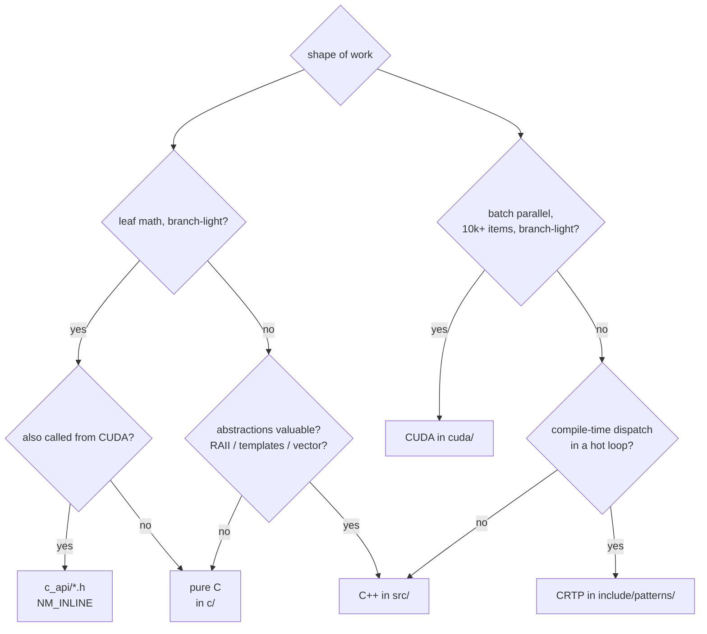

# When to use C, C++, or CUDA

This repo intentionally mixes all three. Each language pulls its weight on
specific shapes of work. The rule of thumb:



## The three regimes

| Regime | Language | Why |
|---|---|---|
| Hot leaf math, fixed-size, branch-light | **C with `NM_INLINE`** | Predictable codegen, no abstraction tax, **same source code runs on CPU and GPU** |
| Library API, RAII, templated containers | **C++** | `std::function`, `std::vector`, `std::unique_ptr` are the right tool for clean APIs and lifetime management |
| Same kernel applied to **millions** of independent items | **CUDA** | Each thread = one item; throughput dominates kernel-launch latency |
| Inner loop where virtual dispatch is too slow | **CRTP / templates** | Compile-time polymorphism keeps the abstraction without the call overhead |
| Calling Claude-API-shaped library from a notebook | **Python / pybind11** | Notebooks are how quants explore; pybind11 is the cleanest adapter |

## Where C beats C++ in this repo

The headers in `include/c_api/` use a macro that expands differently in C/C++
vs. CUDA:

```c
#if defined(__CUDACC__)
  #define NM_INLINE __host__ __device__ static inline
#else
  #define NM_INLINE static inline
#endif
```

So `c_api/inv_normal_cdf.h` is

- a `static inline` function in `c/inv_normal_cdf.c`
- a `static inline` function in `tests/test_c_api.cpp`
- a `__host__ __device__` function in `cuda/monte_carlo_paths.cu`

— all from one source body. That's the payoff: rewrite Acklam once, use it
everywhere. Same trick for `xorshift`, `tridiag`, `blas1`, `cholesky_inplace`.

C wins for these because:

1. **No abstraction tax**. `std::function` carries a heap-or-SBO indirection;
   the call site of a `func` is harder for the compiler to inline. A raw
   function pointer (or no pointer at all) inlines cleanly.
2. **`__restrict__` lets the compiler autovectorize**. The C version of
   `nm_saxpy` says explicitly that `x` and `y` don't alias; the compiler
   emits SIMD. The C++ wrapper can lose that information.
3. **CUDA-portable**. CUDA's C++ subset doesn't include exceptions, RTTI, or
   modern `std::*` features. Restricting yourself to a C-shaped function is
   the cheapest way to ship one body to both targets.
4. **ABI predictability**. `extern "C"` headers are callable from any
   language with a C FFI (Python ctypes, Rust bindgen, etc.) without a
   wrapper.

## Where the sharing strategy breaks

`NM_INLINE` works great for small, fixed-size, branch-light algorithms.
It breaks down when:

- **Register pressure differs.** The GPU prefers many small functions; the
  CPU likes deeper inlining. Sharing a 200-line algorithm produces good code
  on one and bad code on the other. The repo's `cholesky_inplace` is capped
  at $n \le 16$ for this reason.
- **`<math.h>` / `<cmath>` functions diverge.** `sqrt`, `log`, `exp`, `sin`,
  `cos` are fine. `lgamma`, `erfc`, `tgamma` may need CUDA's variants
  (`__device__` substitutes). When in doubt, duplicate.
- **Recursion or dynamic dispatch.** GPU stacks are tiny. Don't share a
  recursive function unless you've measured. CRTP is fine because the
  compiler unrolls the recursion at compile time.
- **Heavy branching.** Warp divergence kills GPU perf. CPU code with deep
  branching is fine; GPU wants straight-line arithmetic. If your algorithm
  branches a lot, write parallel C and CUDA versions.

## Decision examples in this repo

| Function | C? | C++? | CUDA? | Why |
|---|---|---|---|---|
| `xorshift64_next` | C primary | wrapper | shared | tiny, branch-free, both targets |
| `nm_inv_normal_cdf` | C primary | wrapper | shared | fixed-size rational, both targets |
| `nm_thomas_solve` | C primary | wrapper (`Tridiag`) | shared | per-step CPU is sequential; per-grid in CUDA via cuSPARSE |
| `nm_cholesky_inplace` | C primary | wrapper | shared, n ≤ 16 | larger N: switch to cuSOLVER batched |
| `IterativeRootFinder::solve()` | — | C++ only | — | needs `std::function`, virtual dispatch, exceptions |
| `pde::heat_explicit` | C++ host | C++ wrapper | yes — kernel-native | embarrassingly parallel grid stencil |
| `MonteCarloEngineBuilder` | — | C++ only | — | builder lifetime + inheritance |
| `CRTPBisection` | — | C++ template | — | compile-time dispatch over `f` |

## Practical implications for the user

1. **When you write a C primitive** in `c_api/*.h` with `NM_INLINE`, write a
   tiny C TU in `c/<name>.c` that emits the symbol (so non-CUDA callers can
   link to it).
2. **Don't reach for templates if a C function will do** — the compile-time
   cost is real and the maintenance burden is higher. Templates pay off when
   you genuinely need compile-time polymorphism (CRTP §13).
3. **Don't write a CUDA kernel for tiny inputs.** Kernel launch is ~10 µs;
   anything finishing in <100 µs of CPU work isn't worth porting unless you
   have *batched* work.
4. **Profile before deciding.** Run the §13 CRTP benchmark to see the cost
   of virtual dispatch on your specific CPU + compiler combo.
