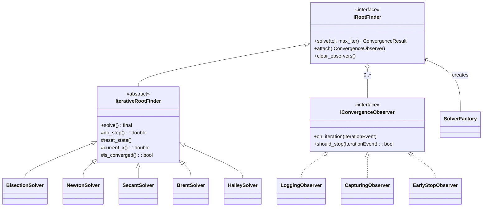

# Design patterns in this repo

Six GoF-style patterns + one stretch (CRTP / static polymorphism). Each is
chosen because it solves a real problem in numerical-methods code, not for
its own sake.

## Class hierarchy at a glance



---

## Creational

### Factory — `nm::patterns::SolverFactory`

**Where**: `include/patterns/solver_factory.h`, `src/patterns/solver_factory.cpp`

**Why it fits**: in calibration code you A/B test methods. A factory lets

```cpp
for (auto kind : {SolverKind::BISECTION, SolverKind::NEWTON, SolverKind::BRENT}) {
    auto s = SolverFactory::create(kind, cfg);
    auto r = s->solve(1e-12, 200);
    // compare iterations, convergence order, runtime
}
```

drive the comparison without per-method constructor noise.

**Validation**: throws `std::invalid_argument` if the config is incomplete
for the chosen kind (e.g. `NEWTON` without `df`, `BISECTION` with bad bracket).

### Builder — `nm::patterns::MonteCarloEngineBuilder`

**Where**: `include/patterns/mc_engine_builder.h`, `src/patterns/mc_engine_builder.cpp`

**Why it fits**: MC engine construction has real invariants — payoff is
required, control-variate needs both `cv_fn` AND `cv_mean`. A builder is more
than fluent setters when `build()` enforces those invariants:

```cpp
auto engine = MonteCarloEngineBuilder()
                  .with_payoff(call_payoff)
                  .with_paths(100'000)
                  .with_antithetic()
                  .with_control_variate(stock_at_T, S0 * std::exp(r*T))
                  .build();   // throws std::invalid_argument if misconfigured
```

---

## Structural

### Decorator — variance-reduction wrappers

**Where**: `include/patterns/mc_decorators.h`, `src/patterns/mc_decorators.cpp`

**Why it fits**: variance reduction is additive. Stackable decorators avoid
`if (use_av) { ... } else if (use_cv) { ... }` branching:


Each decorator implements `IMCEstimator` and holds a `unique_ptr<IMCEstimator>`
to its inner. Composition over inheritance.

### Adapter — pybind11

**Where**: `python/bindings.cpp`

**Footnote pattern**: pybind11 *is* an Adapter (Python types ↔ C++ types) but
the user doesn't write the adapter code by hand — pybind11 generates it. Worth
naming, not worth treating as a featured implementation challenge.

---

## Behavioral

### Strategy — `IRootFinder` interface

**Where**: `include/patterns/iterative_root_finder.h`

The Strategy interface is the type that the Factory returns. Each concrete
solver (`BisectionSolver`, `NewtonSolver`, …) is an interchangeable strategy.

### Template Method — `IterativeRootFinder::solve()`

**Where**: same file. `solve()` is non-virtual final and implements the
skeleton:

```
reset_state()
for k in 0..max_iter:
    x = do_step(abs_err, fx)        # ← virtual hook
    record |e_k|, ++iter, notify observers
    if is_converged(abs_err) or stop_requested:
        return ConvergenceResult{...}
return current_x()
```

Subclasses override only `do_step()` (the single iteration rule). The shared
loop, the convergence check, and the observer fan-out happen in one place. No
copy-pasted "for k = 0..max_iter" across methods.

### Observer — `IConvergenceObserver`

**Where**: `include/patterns/convergence_observer.h`

**Why it fits**: convergence diagnostics, logging, and early-stop predicates
all want to react to iteration events without changing the algorithm. Three
concrete observers ship out of the box:

- **LoggingObserver** — prints to stderr per iteration
- **CapturingObserver** — collects every event for plotting / convergence-order
  estimation
- **EarlyStopObserver** — stops the loop when `abs_error` drops below a
  user-set threshold

Each observer can also veto further iteration via `should_stop()` — the
Template Method respects that vote.

---

## Stretch — CRTP / static polymorphism

**Where**: `include/patterns/crtp_root_finder.h`

Same shape as `IterativeRootFinder` but the dispatch to `do_step()` is
resolved at compile time. The compiler can inline the entire iteration
body — including `f(x)` itself — into `solve()`. On a tight inner loop with
a cheap `f`, the speedup over virtual dispatch is typically **3–10×**.

Why this matters in quant code: calibration loops do millions of solves of
the same `f`. The vtable lookup + `std::function` indirection cost a few ns
each — you can save real money in production.

The trade-off: header-only, longer compile times, can't be selected at runtime
by enum. So a real library offers BOTH (this one does): virtual for
flexibility, CRTP for the hot path. The §13 microbenchmark
(`tests/test_crtp_dispatch.cpp`) prints the actual speedup on your machine.

---

## Summary table

| Pattern | Category | File | Test |
|---|---|---|---|
| Factory | Creational | `solver_factory.{h,cpp}` | `test_factory` |
| Builder | Creational | `mc_engine_builder.{h,cpp}` | `test_mc_builder` |
| Decorator | Structural | `mc_decorators.{h,cpp}` | `test_decorators` |
| Strategy | Behavioral | `iterative_root_finder.h` (`IRootFinder`) | `test_factory` |
| Template Method | Behavioral | `iterative_root_finder.{h,cpp}` (`solve`) | `test_iterative_method` |
| Observer | Behavioral | `convergence_observer.{h,cpp}` | `test_observer` |
| CRTP (stretch) | Static polymorphism | `crtp_root_finder.h` | `test_crtp_dispatch` |
| Adapter (footnote) | Structural | `python/bindings.cpp` | `tests/python/*` |
