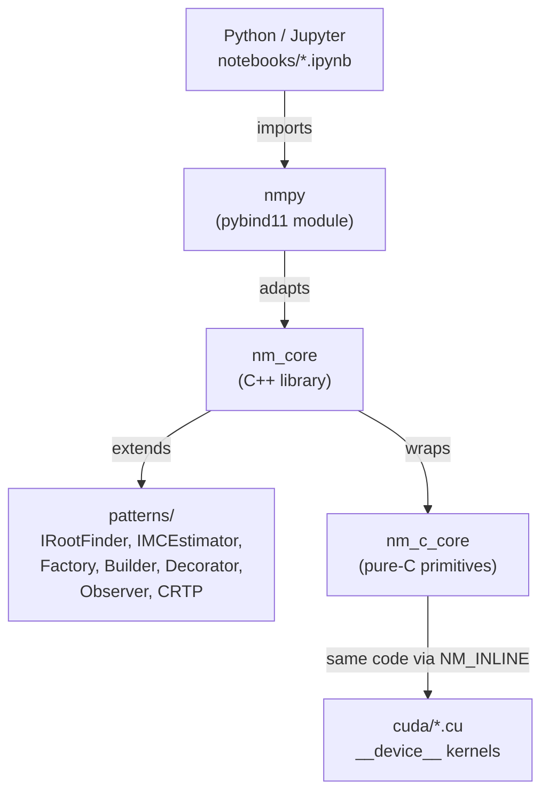
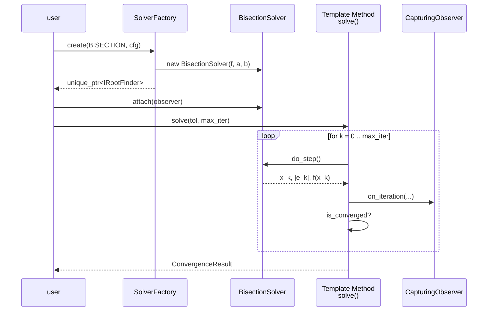

# numerical_methods — quant-dev learning lab

A C / C++ / CUDA scaffold for implementing classical numerical methods, with
modern design patterns wired into the architecture and a Python/Jupyter
frontend via pybind11. The whole repo is **a checkbox-driven challenge**: each
algorithm is a stub that throws `nm::not_implemented`; CI runs only the tests
for items you've checked off in `TODO.md`.

## Build & run

```bash
make build               # configure + compile (auto-formats first)
make run                 # run the demo runner
make test                # run only checked TODO items + baseline
make test-all            # run every test (no gating)
make clean               # remove build/
```

For Python/Jupyter:

```bash
cmake -S . -B build -DNM_USE_PYTHON=ON -Dpybind11_DIR="$(python -m pybind11 --cmakedir)"
cmake --build build
make notebooks           # opens jupyter lab on notebooks/
```

For CUDA: `cmake -DNM_USE_CUDA=ON ...`.

## Architecture



- Python sees a clean adapter layer (the `nmpy` module).
- C++ holds the bulk of the library: data structures, algorithms,
  design-pattern infrastructure.
- C primitives are a reusable core for hot leaf math, callable from C, C++,
  and CUDA `__device__` code via the `NM_INLINE` macro.
- CUDA kernels include the same C headers — the algorithm body is shared.

## Documents

- **[PATTERNS.md](PATTERNS.md)** — every design pattern in this repo, with
  class diagrams and quant justification.
- **[LANGUAGE_CHOICES.md](LANGUAGE_CHOICES.md)** — when to reach for C, C++,
  or CUDA, and where the `NM_INLINE` sharing strategy breaks down.
- **[ERROR_HANDLING.md](ERROR_HANDLING.md)** — error philosophy per language
  layer, validated by tests.
- **[NOTEBOOKS.md](NOTEBOOKS.md)** — what each Jupyter notebook teaches.

## How a single iteration flows through the OO API



## Math you'll need

Convergence-rate fitting (used by `estimate_order`):

$$
|e_{k+1}| \approx C \, |e_k|^p \quad\Longrightarrow\quad p \approx \frac{\log\big(|e_{k+1}|/|e_k|\big)}{\log\big(|e_k|/|e_{k-1}|\big)}
$$

European call under Black-Scholes (you'll reproduce this in
`notebooks/03_pde_pricing.ipynb`):

$$
C(S_0, K, T) = S_0 \, \Phi(d_1) - K e^{-rT} \, \Phi(d_2),
\quad d_{1,2} = \frac{\ln(S_0/K) + (r \pm \tfrac{\sigma^2}{2})T}{\sigma\sqrt{T}}
$$

Newton's method update:

$$
x_{n+1} = x_n - \dfrac{f(x_n)}{f'(x_n)}
$$
