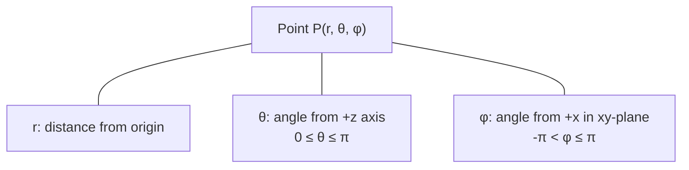
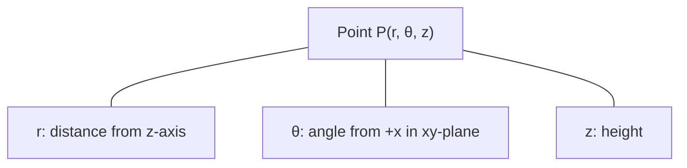
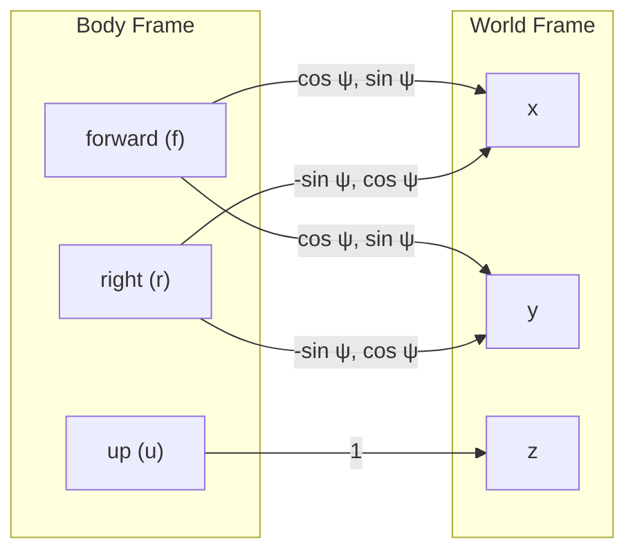
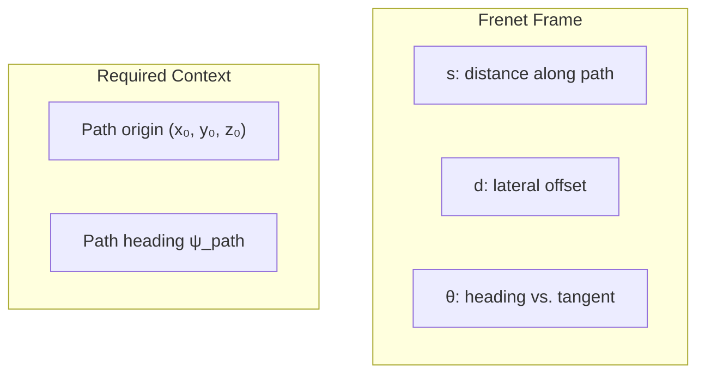
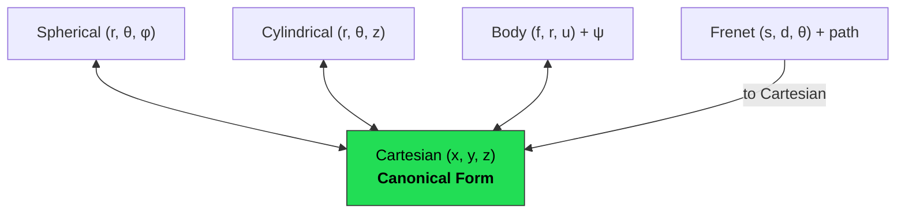

# Vec3 - Mathematical Reference

A rigorous treatment of the coordinate systems and transformations implemented in this library.

## 1. Cartesian Coordinates

The standard orthonormal basis $\hat{x}, \hat{y}, \hat{z}$ in $\mathbb{R}^3$. A vector is represented as:

$$\vec{v} = x\hat{x} + y\hat{y} + z\hat{z}$$

### Vector Operations

**Addition:**

$$\vec{a} + \vec{b} = (a_x + b_x)\hat{x} + (a_y + b_y)\hat{y} + (a_z + b_z)\hat{z}$$

**Scalar multiplication:**

$$\alpha\vec{v} = (\alpha x)\hat{x} + (\alpha y)\hat{y} + (\alpha z)\hat{z}$$

**Dot product:**

$$\vec{a} \cdot \vec{b} = a_x b_x + a_y b_y + a_z b_z = \|\vec{a}\|\|\vec{b}\|\cos\theta$$

**Cross product:**

$$\vec{a} \times \vec{b} = \begin{vmatrix} \hat{x} & \hat{y} & \hat{z} \\ a_x & a_y & a_z \\ b_x & b_y & b_z \end{vmatrix} = (a_y b_z - a_z b_y)\hat{x} + (a_z b_x - a_x b_z)\hat{y} + (a_x b_y - a_y b_x)\hat{z}$$

**Magnitude (Euclidean norm):**

$$\|\vec{v}\| = \sqrt{x^2 + y^2 + z^2}$$

**Unit vector:**

$$\hat{v} = \frac{\vec{v}}{\|\vec{v}\|}, \quad \|\vec{v}\| \neq 0$$

---

## 2. Spherical Coordinates

A point is described by radius $r$, polar angle $\theta$ (from the $+z$ axis), and azimuthal angle $\phi$ (from the $+x$ axis in the $xy$-plane).

### Spherical to Cartesian

$$x = r\sin\theta\cos\phi$$

$$y = r\sin\theta\sin\phi$$

$$z = r\cos\theta$$

### Cartesian to Spherical

$$r = \sqrt{x^2 + y^2 + z^2}$$

$$\theta = \arccos\left(\frac{z}{r}\right), \quad r \neq 0$$

$$\phi = \text{atan2}(y, x)$$

We use $\text{atan2}$ rather than $\arctan$ to correctly handle all four quadrants and produce $\phi \in (-\pi, \pi]$.

---

## 3. Cylindrical Coordinates

A point is described by radial distance $r$ (from the $z$-axis), angle $\theta$ (from the $+x$ axis), and height $z$.

### Cylindrical to Cartesian

$$x = r\cos\theta$$

$$y = r\sin\theta$$

$$z = z$$

### Cartesian to Cylindrical

$$r = \sqrt{x^2 + y^2}$$

$$\theta = \text{atan2}(y, x)$$

$$z = z$$

---

## 4. Body-Fixed Frame

A vehicle-centric coordinate system with axes aligned to the vehicle's orientation. The body frame $(\hat{f}, \hat{r}, \hat{u})$ represents forward, right, and up respectively.

The transformation between body and world frames is a 2D rotation by the yaw angle $\psi$ (rotation about the vertical axis):

### Body to World (Cartesian)

$$\begin{pmatrix} x \\ y \\ z \end{pmatrix} = \begin{pmatrix} \cos\psi & -\sin\psi & 0 \\ \sin\psi & \cos\psi & 0 \\ 0 & 0 & 1 \end{pmatrix} \begin{pmatrix} f \\ r \\ u \end{pmatrix}$$

Expanded:

$$x = f\cos\psi - r\sin\psi$$

$$y = f\sin\psi + r\cos\psi$$

$$z = u$$

### World to Body

The inverse is the transpose of the rotation matrix (rotation matrices are orthogonal):

$$\begin{pmatrix} f \\ r \\ u \end{pmatrix} = \begin{pmatrix} \cos\psi & \sin\psi & 0 \\ -\sin\psi & \cos\psi & 0 \\ 0 & 0 & 1 \end{pmatrix} \begin{pmatrix} x \\ y \\ z \end{pmatrix}$$

$$f = x\cos\psi + y\sin\psi$$

$$r = -x\sin\psi + y\cos\psi$$

$$u = z$$

---

## 5. Frenet-Serret Frame

A path-relative coordinate system. Given a reference path (e.g., a road centerline), a point is described by:

- $s$: arc length along the path
- $d$: signed lateral offset from the path (positive = left)
- $\theta$: heading relative to the path tangent

### Frenet to World (Cartesian)

Given a path origin $(x_0, y_0, z_0)$ and path heading $\psi_{\text{path}}$, the linearized (locally straight path) transformation is:

$$x = x_0 + s\cos\psi_{\text{path}} - d\sin\psi_{\text{path}}$$

$$y = y_0 + s\sin\psi_{\text{path}} + d\cos\psi_{\text{path}}$$

$$z = z_0$$

This is a first-order approximation valid when the path curvature $\kappa$ is small relative to the lateral offset, i.e., $|\kappa \cdot d| \ll 1$. For curved paths, the full Frenet-Serret formulas involve integrating along the path curvature.

---

## 6. Design: Cartesian as Canonical Form

All coordinate systems convert through Cartesian. This is a hub-and-spoke topology:

For $N$ coordinate systems, this requires $2N$ conversion functions instead of $N(N-1)$ pairwise conversions. Arithmetic (addition, dot product, cross product) is defined only in Cartesian, which is mathematically natural since these operations rely on the linear structure of $\mathbb{R}^3$.

### Conversion Complexity

| Conversion | Time Complexity | Trig Calls |
|-----------|----------------|------------|
| Spherical $\leftrightarrow$ Cartesian | $O(1)$ | 3-4 |
| Cylindrical $\leftrightarrow$ Cartesian | $O(1)$ | 2-3 |
| Body $\leftrightarrow$ Cartesian | $O(1)$ | 2 |
| Frenet $\rightarrow$ Cartesian | $O(1)$ | 2 |

All conversions are constant-time with a small fixed number of trigonometric function evaluations.
