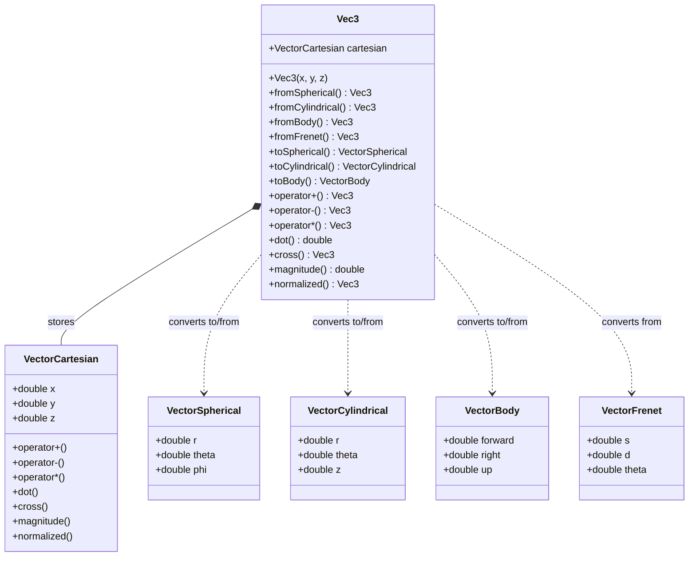
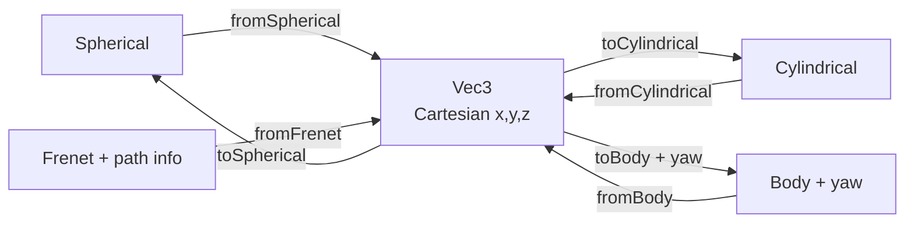

# Vec3 - 3D Vector Library

A simple C++ library for working with 3D vectors across multiple coordinate systems.

## What It Does

Vec3 lets you create 3D vectors and convert between different ways of describing a point in space. Think of it like GPS coordinates vs street addresses — same location, different representations.

## Coordinate Systems

| System | Components | Good For |
|--------|-----------|----------|
| **Cartesian** | x, y, z | General math, addition, subtraction |
| **Spherical** | radius, theta, phi | Rotation, orbits, angles |
| **Cylindrical** | radius, theta, z | Circular motion with height |
| **Body** | forward, right, up | Vehicle-relative forces and motion |
| **Frenet** | s, d, theta | Position along a road or path |

## Architecture



## Conversion Flow



All conversions go through Cartesian as the canonical form. This keeps the design simple — instead of needing N x N conversion functions, we only need N "to" and N "from" functions.

## Folder Structure

```
Vec3/
├── Vec3.hpp / Vec3.cpp            # Main class — owns conversions and arithmetic
├── Cartesian/
│   ├── VectorCartesian.hpp/cpp    # x, y, z with vector math operators
├── Spherical/
│   ├── VectorSpherical.hpp/cpp    # r, theta, phi data
├── Cylindrical/
│   ├── VectorCylindrical.hpp/cpp  # r, theta, z data
├── Frenet/
│   ├── VectorFrenet.hpp/cpp       # s, d, theta data
└── Body/
    ├── VectorBody.hpp/cpp         # forward, right, up data
```

## Quick Start

```cpp
#include "Vec3/Vec3.hpp"

// Create from cartesian
Vec3 a(1, 2, 3);
Vec3 b(4, 5, 6);

// Arithmetic
Vec3 sum = a + b;
double d = a.dot(b);
Vec3 c = a.cross(b);

// Convert from spherical
Vec3 v = Vec3::fromSpherical(5.0, M_PI/4, M_PI/6);

// Convert to cylindrical
VectorCylindrical cyl = v.toCylindrical();

// Body frame: car facing 45 degrees, 10m/s forward
VectorBody accel(10.0, 0.5, 0.0);
Vec3 worldAccel = Vec3::fromBody(accel, M_PI/4);
```

## Build

```bash
make all    # format + build + run
make clean  # remove build directory
```
