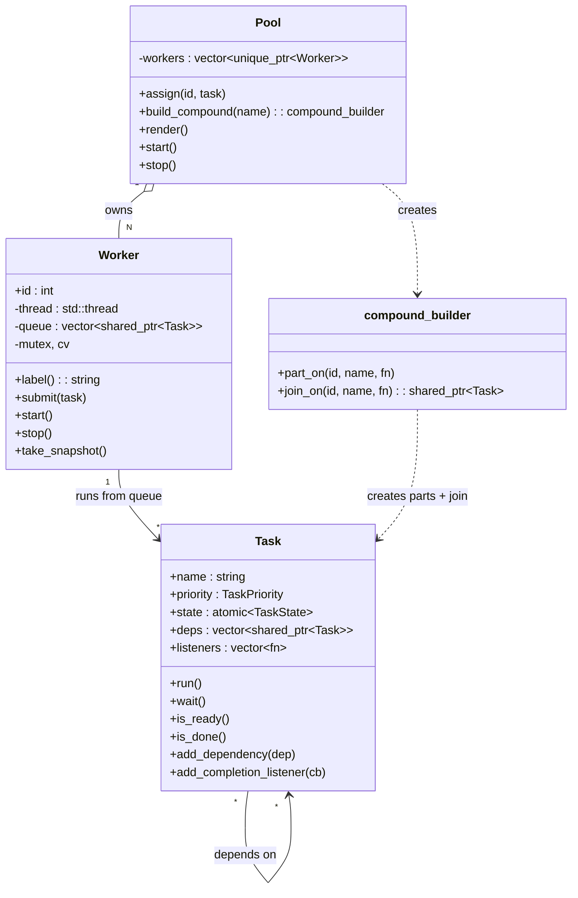
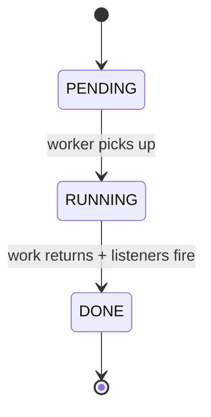
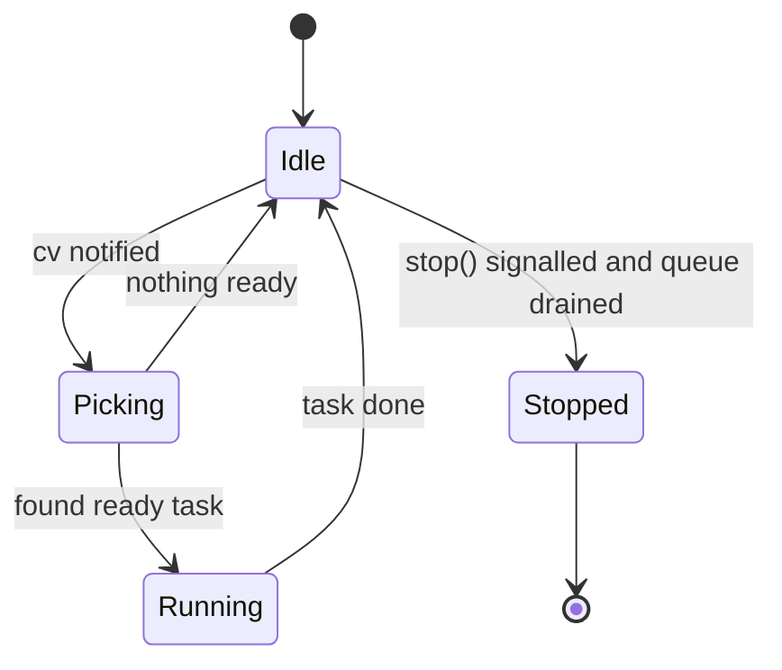
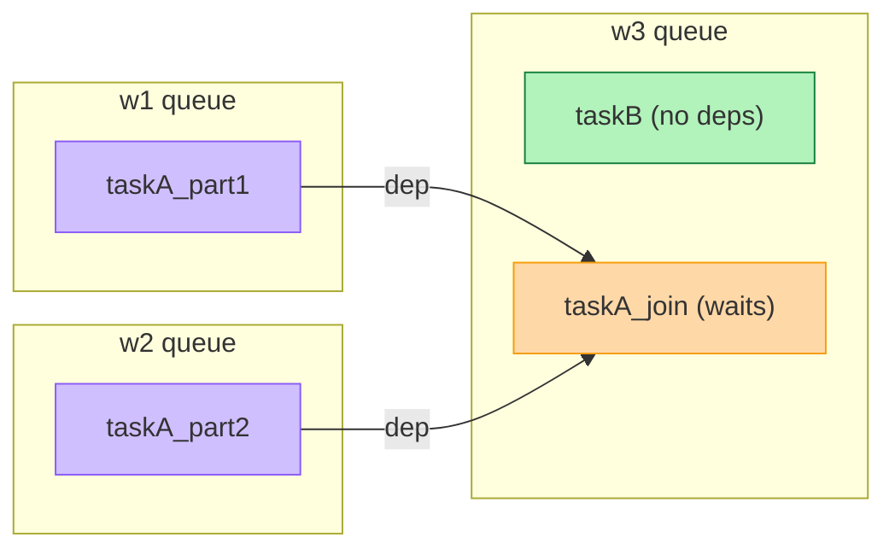
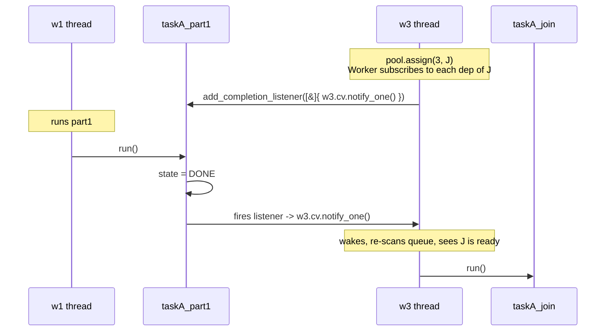

# task_thread

A small, readable C++17 task scheduler built to learn how concurrency works.
Each **Worker** is a named thread (`w1`, `w2`, ..., `wN`) with its own queue.
**Tasks** can depend on other tasks, so a task on `w3` can wait for tasks on
`w1` and `w2` to finish first.

---

## Build and run

```bash
make          # compile to build/task_thread
make run      # compile + execute
make clean    # remove build/ if it exists
make help     # list targets
```

CMake works too: `cmake -S . -B build && cmake --build build`.

---

## File layout

```
task_thread/
├── Makefile
├── CMakeLists.txt
├── main.cpp                    # tiny entry point, calls runner()
└── src/
    ├── Task/    { task.hpp,    task.cpp    }   # one unit of work
    ├── Worker/  { worker.hpp,  worker.cpp  }   # one thread with a queue
    ├── Pool/    { pool.hpp,    pool.cpp    }   # registry + builder
    └── Runner/  { runner.hpp,  runner.cpp  }   # the demo scenario
```

Forward declarations keep header includes minimal:

- `worker.hpp` forward-declares `Task` (it only stores `shared_ptr<Task>`).
- `pool.hpp` forward-declares `Worker` (it only stores `unique_ptr<Worker>`);
  the full `worker.hpp` is pulled in only by `pool.cpp`.

---

## Per-component docs

Deeper write-ups, one per class — what it does, how to create it, what it
relies on, and the subtle bits:

- [Task](docs/Task.md) — one unit of work (Command + Observer)
- [Worker](docs/Worker.md) — one thread + one queue
- [Pool](docs/Pool.md) — registry of workers + Builder for compound tasks
- [Runner](docs/Runner.md) — the demo scenario

---

## Class diagram — who owns what



- `Pool` **owns** its workers by `unique_ptr` (exclusive ownership).
- `Worker` **runs** tasks it holds by `shared_ptr` (shared, because a dep is
  also pointed to by downstream tasks).
- A `Task` can **depend on** any number of other `Task`s.

---

## State diagram — a single Task

Every Task moves through exactly three states, in order:



`state` is a `std::atomic<TaskState>` so any thread can read it safely.

---

## State diagram — a single Worker

Each Worker runs this loop on its own thread until `stop()` is called:



The wait condition is a single `std::condition_variable::wait(lock, pred)` —
cheap, no polling, wakes on notify.

---

## What makes a task "ready"?

A task is **ready** exactly when every one of its dependencies has reached
`DONE`:

$$
\operatorname{ready}(T) \iff \forall d \in \operatorname{deps}(T):\ \operatorname{state}(d) = \text{DONE}
$$

If $\operatorname{deps}(T) = \emptyset$, the condition is vacuously true, so a
task with no deps is ready the moment it is submitted.

When a worker wakes up, it picks the highest-priority ready task from its
queue:

$$
\operatorname{next}(Q) = \arg\max_{T \in Q,\ \operatorname{ready}(T)} \operatorname{priority}(T)
$$

Ties are broken by queue insertion order.

---

## The runtime scenario (what `runner()` builds)



**What you should observe when you run it:**

1. `w3` runs `taskB` immediately (green — no deps).
2. `w1` and `w2` run their parts in parallel (purple — running).
3. `taskA_join` sits in `w3`'s queue (orange — waiting).
4. When both parts finish, they fire their completion listeners, which call
   `notify_one()` on `w3`. `w3` wakes, re-scans its queue, sees the join is
   now ready, and runs it.

---

## Why it's fast: the parallelism math

If the three stages take $t_1$, $t_2$, and $t_J$ seconds respectively, the
compound task's wall-clock time is:

$$
T_{\text{parallel}} = \max(t_1,\ t_2) + t_J
$$

Done strictly sequentially, it would take:

$$
T_{\text{serial}} = t_1 + t_2 + t_J
$$

Speedup:

$$
S = \frac{T_{\text{serial}}}{T_{\text{parallel}}} = \frac{t_1 + t_2 + t_J}{\max(t_1, t_2) + t_J}
$$

With the demo values $t_1 = 500\,\text{ms}$, $t_2 = 400\,\text{ms}$,
$t_J = 100\,\text{ms}$:

$$
S = \frac{500 + 400 + 100}{500 + 100} = \frac{1000}{600} \approx 1.67\times
$$

This is the classic **fork-join** shape. In general, for $n$ parallel parts
the lower bound on wall time is $\max_i t_i + t_J$ — you can never go faster
than the slowest part plus the join.

---

## How notifications propagate (the clever bit)

The interesting part of the code is how a worker "knows" that a dep finished
on a **different** worker. It doesn't poll. Instead:



Three primitives do all the work:

| Primitive | Role |
|---|---|
| `std::mutex` | protects a Worker's queue |
| `std::condition_variable` | lets the Worker sleep instead of spinning |
| `std::atomic<TaskState>` | lets any thread cheaply read `is_done()` |

---

## Design patterns used

- **Command** — `Task` wraps a `std::function<void()>` so a "unit of work"
  is a first-class value.
- **Observer** — `Task::add_completion_listener` lets anyone subscribe to
  completion. Workers use this to wake themselves when a dep finishes.
- **Builder** — `Pool::build_compound().part_on(...).part_on(...).join_on(...)`
  assembles a parts-and-join graph fluently at the call site.

---

## Deliberately simple (things I did NOT build)

- No work-stealing; assignment is sticky.
- No cycle detection on the dependency graph — submit parents first.
- Worker's "pick" is an $O(n)$ scan of its queue. Fine for small $n$; swap
  for a `std::priority_queue` if you ever queue thousands of tasks.
- `Pool::render()` is a one-shot snapshot. No live refresh.

Keeping it short on purpose — this project is for understanding, not
production use.
