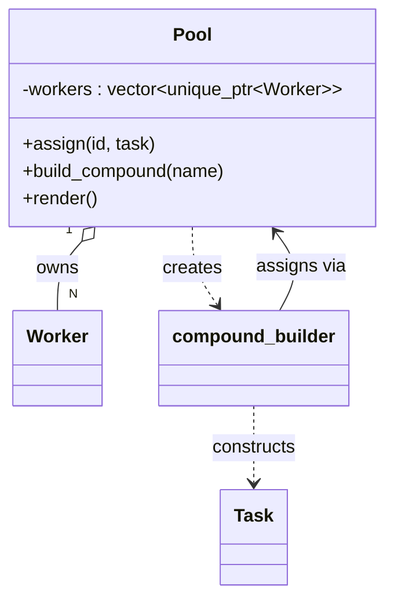

# Pool

**Files:** `src/Pool/pool.hpp`, `src/Pool/pool.cpp`

## Its job

The Pool is **the registry of named workers and the dispatcher for tasks**.
It also hosts a Builder (`compound_builder`) that assembles "parts across
many workers, one join at the end" task graphs fluently.

## What it relies on

| Dependency | Why |
|---|---|
| **Task** (full include) | `compound_builder` references `Task::work_fn` — a nested typedef that needs the full Task definition visible. |
| **Worker** (forward-declared) | Pool stores `std::vector<std::unique_ptr<Worker>>`; using `unique_ptr<T>` only needs a forward declaration as long as the destructor is defined out-of-line (which it is, in `pool.cpp`). |
| `std::unique_ptr` | exclusive ownership — Pool destroys its Workers in order. |

The forward-declaration trick keeps `worker.hpp` out of every translation
unit that only needs Pool's interface (like `runner.cpp` and `main.cpp`),
cutting compile time and hiding internals.

## How to create one

```cpp
#include "pool.hpp"

Pool pool(3);     // creates w1, w2, w3 (ids 1..3)
pool.start();     // spin up 3 threads

// ... submit work ...

pool.stop();      // joins every worker thread (also happens in ~Pool)
```

## Submitting work — two ways

### 1. Direct assignment

For a task that just needs to land on a specific worker:

```cpp
auto t = std::make_shared<Task>("hello", []{ /*...*/ });
pool.assign(3, t);   // goes to w3
```

Throws `std::invalid_argument` if the worker id doesn't exist.

### 2. Compound builder (parts + join)

For the common "run pieces in parallel, then do a join step" shape:

```cpp
auto joined = pool.build_compound("taskA")
    .part_on(1, "taskA_part1", [] { /* runs on w1 */ })
    .part_on(2, "taskA_part2", [] { /* runs on w2 */ })
    .join_on(3, "taskA_join",  [] { /* runs on w3 */ });

joined->wait();      // blocks until the join finishes
```

`part_on` ships each piece to its worker immediately. `join_on` creates one
more task, adds every prior part as a dependency, and ships it to its
worker. The join sits in the queue as "not ready" until every part is DONE.

## Relationships



## Key methods

| Method | What it does |
|---|---|
| `Pool(n)` | Construct `n` workers with ids `1..n`. |
| `start()` | Start every worker's thread. |
| `stop()` | Stop + join every worker thread. Called by `~Pool` too. |
| `assign(id, task)` | Submit `task` to worker `id`. |
| `build_compound(name)` | Return a `compound_builder` to fluently assemble a multi-worker task graph. |
| `render()` | Print one snapshot line per worker: state, current task, backlog. |

## `compound_builder` in detail

| Method | Returns | Purpose |
|---|---|---|
| `part_on(id, name, fn, pr?)` | `compound_builder&` | Create a part task, ship it to worker `id`, remember it as a prerequisite. |
| `join_on(id, name, fn, pr?)` | `shared_ptr<Task>` | Create the join task, depend on every prior part, ship it, return it so callers can `wait()`. |

The returned `shared_ptr<Task>` is how the caller blocks until the whole
compound is done.

## Why the join can sit behind other tasks

Workers run tasks out of queue order when necessary — they pick the
highest-priority **ready** task. So if w3 holds `[taskA_join, taskB]` and
taskA_join's deps are still running, w3 will happily run taskB first.

That's the whole reason workers scan their queue instead of using a simple
`std::queue::pop()`.

## Who uses it

- **`runner()`** in `src/Runner/runner.cpp` is the only current caller — it
  constructs a 3-worker Pool and uses both `assign` and `build_compound`.
