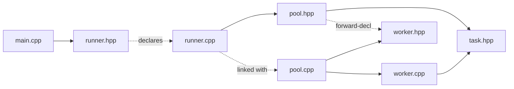

# Runner

**Files:** `src/Runner/runner.hpp`, `src/Runner/runner.cpp`

## Its job

Runner is **the demo**. It owns no state, declares one free function
`runner()`, and uses Pool + Task to run a concrete multi-worker scenario
end-to-end.

It exists as its own translation unit so `main.cpp` stays a two-line entry
point and the interesting wiring lives in one place.

## What it relies on

| Dependency | Why |
|---|---|
| **Pool** (`pool.hpp`) | to create workers and dispatch tasks |
| **Task** (transitively, via `pool.hpp`) | to construct standalone tasks via `std::make_shared<Task>` |
| `<chrono>`, `<thread>` | for `sleep_for` (fake work duration) |
| `<iostream>` | to print progress |

Nothing in `runner.hpp` requires forward declarations — the header just
declares one free function:

```cpp
void runner();
```

## How it's wired in



`main.cpp` includes only `runner.hpp` and calls `runner()`. That is the
entire public surface of the project.

## The scenario it runs

1. Build a `Pool(3)` — three workers `w1`, `w2`, `w3`.
2. Submit a **standalone task** `taskB_on_w3` (no deps) to `w3`.
3. Use `build_compound("taskA")` to create:
   - `taskA_part1_on_w1` on `w1`
   - `taskA_part2_on_w2` on `w2`
   - `taskA_join_on_w3` on `w3`, depending on both parts
4. Sleep 50 ms, then `pool.render()` to print a live snapshot.
5. `wait()` on the join and on the standalone task.
6. `pool.render()` again (everything idle now).
7. `pool.stop()`.

### Expected output order

```
[w3] running taskB
[w2] running taskA_part2    (these two run concurrently with taskB)
[w1] running taskA_part1
--- pool state ---
w1 [RUNNING] current=taskA_part1_on_w1 backlog=0
w2 [RUNNING] current=taskA_part2_on_w2 backlog=0
w3 [RUNNING] current=taskB_on_w3 backlog=1   ← join is queued, waiting
[w3] running taskA_join                        ← fires once both parts DONE

after completion:
w1 [IDLE] ...
w2 [IDLE] ...
w3 [IDLE] ...
```

## Why it matters for understanding

This file is the smallest possible piece of code that exercises every
interesting property of the system:

- **Parallelism** — `part1` and `part2` run concurrently with `taskB`.
- **Dependencies** — the join does not fire until both parts are DONE.
- **Out-of-order execution within a worker** — `w3` runs `taskB` before the
  earlier-queued-but-not-ready `taskA_join`.
- **Cross-thread wakeup** — `w3` wakes up because listeners on `part1` and
  `part2` (which run on `w1` and `w2`) call `notify_one()` on `w3`'s CV.
- **Clean shutdown** — every thread joins before `main` returns.

## Extending it

Easy modifications to try:

- Change the sleep durations to flip which part finishes first — the join
  behavior must not change.
- Add a third part `part_on(3, ...)` and observe `w3`'s backlog grow.
- Submit a `TaskPriority::HIGH` standalone task after the compound is
  assembled and watch it jump ahead of the waiting join on `w3`.
- Call `pool.render()` from a separate `std::thread` on a timer to build a
  poor-man's `htop`.
