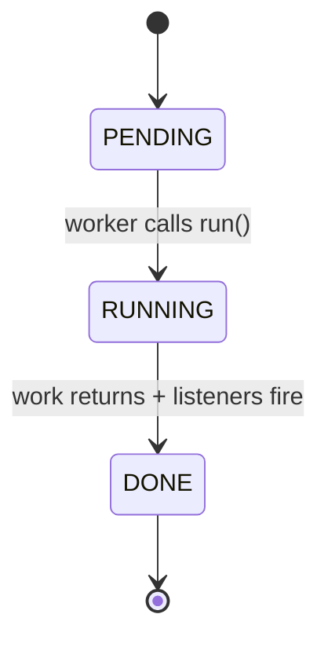

# Task

**Files:** `src/Task/task.hpp`, `src/Task/task.cpp`

## Its job

One Task = **one unit of work that knows when it's done and who to tell**.

It wraps a callable (the actual work), tracks its own lifecycle state, holds a
list of dependencies it must wait for, and holds a list of listeners to
notify once it finishes.

## What it relies on

| Dependency | Why |
|---|---|
| `std::function<void()>` | the work payload (Command pattern) |
| `std::shared_ptr<Task>` | dependencies are shared — the join task and the worker both need to keep them alive |
| `std::atomic<TaskState>` | any thread can cheaply read `is_done()` without taking a lock |
| `std::mutex` + `std::condition_variable` | protect the listener list and let `wait()` block without spinning |

No forward declarations needed — Task is a leaf in the dependency DAG.

## How to create one

```cpp
#include "task.hpp"
#include <memory>
#include <iostream>

// Always construct via shared_ptr — workers and deps store shared_ptr<Task>.
auto t = std::make_shared<Task>(
    "compile_main",                           // human-readable name
    [] { std::cout << "compiling...\n"; },    // the work (a lambda)
    TaskPriority::HIGH                        // optional, defaults to MEDIUM
);
```

To make one task depend on another:

```cpp
auto part1 = std::make_shared<Task>("part1", []{ /*...*/ });
auto part2 = std::make_shared<Task>("part2", []{ /*...*/ });
auto join  = std::make_shared<Task>("join",  []{ /*...*/ });

join->add_dependency(part1);
join->add_dependency(part2);
// join is now "not ready" until both part1 and part2 reach DONE.
```

## The lifecycle



Defined by `enum class TaskState { PENDING, RUNNING, DONE }`.

## Key methods

| Method | What it does |
|---|---|
| `run()` | Executes the work, flips state to DONE, fires every listener. Called by a Worker thread. |
| `wait()` | Blocks the caller until state is DONE. Used by `main()` to wait for the whole graph. |
| `is_ready()` | True when every dep is DONE (so this task may now run). |
| `is_done()` | Atomic read of state == DONE. |
| `add_dependency(dep)` | Register a prerequisite. Call before submitting to a worker. |
| `add_completion_listener(cb)` | Subscribe to be notified on completion. If the task is already DONE, `cb` fires immediately. |

## The readiness rule

$$
\operatorname{ready}(T) \iff \forall d \in \operatorname{deps}(T):\ \operatorname{state}(d) = \text{DONE}
$$

A task with no deps is vacuously ready.

## Internal mechanics

The subtle part is `run()`:

1. Flip state to `RUNNING`.
2. Invoke the work function.
3. Under the mutex: set state to `DONE` and **swap** the listener vector
   into a local copy.
4. Release the lock, then fire each listener.

Listeners run **outside** the task's lock because a listener might turn
around and call `add_completion_listener` on this same task (or another one)
— holding the lock during the callback would be a self-deadlock risk.

## Who uses it

- **Worker** runs it by calling `run()` off its queue.
- **Worker** also subscribes to its deps via `add_completion_listener` so it
  wakes up when a dep completes on another thread.
- **Pool::compound_builder** creates Tasks and wires up dependencies.
