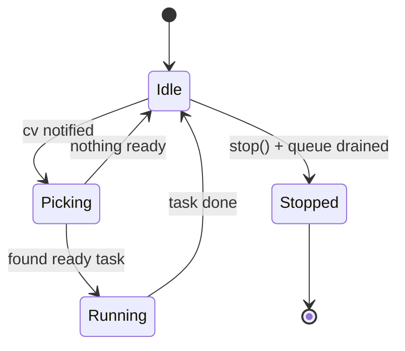

# Worker

**Files:** `src/Worker/worker.hpp`, `src/Worker/worker.cpp`

## Its job

One Worker = **one OS thread draining its own private queue of Tasks**.

Each Worker is named `w1`, `w2`, ..., `wN`. Its thread sleeps on a condition
variable between jobs and wakes up when (a) a new task arrives, (b) a
dependency it was waiting on finishes, or (c) it's told to stop.

## What it relies on

| Dependency | Why |
|---|---|
| `std::thread` | one OS thread per worker |
| `std::mutex` + `std::condition_variable` | guard the queue; sleep between jobs without spinning |
| `std::shared_ptr<Task>` (forward-declared) | the queue holds shared ownership of tasks |
| `std::atomic<bool>` | lock-free `m_stop` / `m_running` flags |

**Forward declaration:** `worker.hpp` only forward-declares `Task` —
`#include "task.hpp"` is not needed in the header because the header only
uses `shared_ptr<Task>` (a pointer type). The full `task.hpp` is included
in `worker.cpp` where method bodies call `task->run()`, `task->is_ready()`,
etc.

## How to create one

You usually do not create Workers directly — **Pool** does. But the
interface looks like this:

```cpp
#include "worker.hpp"

Worker w(1);          // id = 1, label becomes "w1"
w.start();            // spin up the thread

w.submit(task);       // hand it a task

w.stop();             // signal + join (also happens in ~Worker)
```

## How it runs — the loop



Each iteration of `run_loop()`:

1. Sleep on `m_cv` until either `stop` is requested or a ready task exists.
2. If stopping and no ready work remains, exit.
3. Under the lock: pick the highest-priority ready task, record it as
   `m_current_task`.
4. Release the lock and call `task->run()`. Long-running work does **not**
   block `submit()` from enqueueing more.
5. Clear `m_current_task` and loop.

## Key methods

| Method | What it does |
|---|---|
| `start()` | Spin up the thread. Idempotent — safe to call twice. |
| `stop()` | Atomically set `m_stop`, notify, join the thread. |
| `submit(task)` | Enqueue a task; subscribe this worker to each dep's completion. |
| `take_snapshot()` | Return a `Snapshot { id, label, state, current_task, backlog }`. Used by `Pool::render()`. |
| `label()` | Returns `"w<id>"`. |

## The clever bit — waking up on a dep

When you `submit(T)`, the Worker walks `T->dependencies()` and on each dep
calls:

```cpp
dep->add_completion_listener([this] { m_cv.notify_one(); });
```

So when that dep finishes on some **other** worker's thread, its listener
runs on that other thread and calls `notify_one()` on **this** worker's CV.
This worker wakes up, re-scans its queue, finds `T` is now ready, and runs
it.

No polling. No shared global state. Just a targeted wakeup.

## Task selection

When there are multiple ready tasks, Worker picks by priority:

$$
\operatorname{next}(Q) = \arg\max_{T \in Q,\ \operatorname{ready}(T)} \operatorname{priority}(T)
$$

Ties broken by queue insertion order. This is currently an $O(n)$ scan of
the queue per pick — fine for small queues.

## Who uses it

- **Pool** owns every Worker by `unique_ptr` and routes tasks to them by id.
- **Task** does not know about Worker — the relationship is one-way
  (Worker → Task). The Observer pattern is how Tasks signal back to
  Workers without holding a pointer to them.
